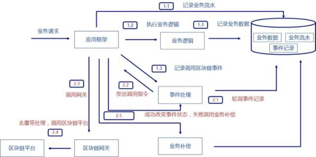

1: 如何解决分布式数据一致性问题？工作量证明，联盟链中用其他共识算法规避挖矿情况的发生。
2: 如何传递秘要、如果加解密？
3: 智能合约？（运行在沙箱中）
4: 记账节点、非记账节点
5: 区块链平台服务能力有限，什么意思？异步、限流、隔离、服务升降级

MiddlePipe、MiddleBox、Hook／轮询

公有链、私有链、联盟链: 联盟链可通过业务手段规避数据安全问题（可见、不可见节点）

1: 区块链与微服务: 
  1.1: 事务一致性: 一般情况下微服务中的业务处理采用异步模式，发出记账申请后处于等待状态，区块链网关将记账申请转发给区块链平台。
       如果区块链平台返回接受Accept或者拒绝Reject，将结果通知微服务；如果区块链平台返回超时或者不可确定错误，即开始定时轮询，得到结果后通知微服务。
       同时，微服务本身需要具备事务补偿的模式，如果记账失败进行反交易处理。这种数据一致性处理的方式，是微服务多种处理方式中的一种.
       
