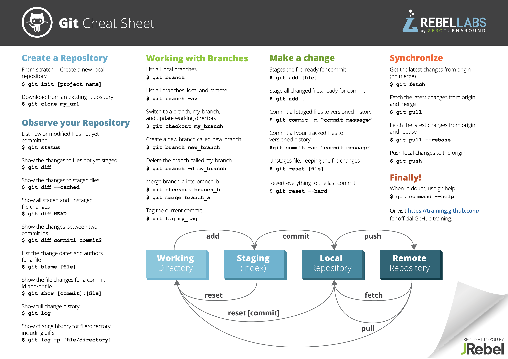

命令大全: 
* Git仓库：工作区-->暂存区-->本地仓库-->远程仓库
* 与SVN区别：SVN是物理寻址系统（路径），Git是内容寻址系统（哈希值）

1: 仓库
  Create a new repository:
    git clone git@172.16.101.84:username/ssss.git
    cd ssss
    touch README.md
    git add README.md
    git commit -m "add README"
    git push -u origin master

  Existing folder or Git repository:
    cd existing_folder
    git init
    git remote add origin git@172.16.101.84:username/ssss.git
    git push -u origin master

  git clone git@172.172.172.172:member：从服务器clone代码

  拉最新代码:
    git pull = git fetch + git merge
    git pull --rebase = git fetch + git rebase
        # http://www.cnblogs.com/kevingrace/p/5896706.html
        merge: 合并后会产生一个新的commit，commit到upstream后产生一个菱形的network，origin的comit不会被删除。
        rebase: 合并后不会产生一个新的commit，commit到upstream后产生一个直线型的network，origin的comit会被删除。

  git fetch --tags：当有tag无法通过git pull命令获取时，请尝试这个命令

  远程信息:
    要查看远程库的信息，用git remote：
    $ git remote  //或者，用git remote -v显示更详细的信息：

    $ git remote -v
    origin  git@github.com:michaelliao/learngit.git (fetch)     //可以抓取的origin的地址
    origin  git@github.com:michaelliao/learngit.git (push)      //可以推送的origin的地址,如果没有推送权限，就看不到push的地址。

  fork: http://www.jianshu.com/p/9fd449340ea5
    1.查看是否有远程分支: git remote -v
      origin  http://10.199.192.11/torres/nbiz.git (fetch)
      origin  http://10.199.192.11/torres/nbiz.git (push)
    2.如果没有需要添加远程的fork之前的原仓库: git remote add upstream http://10.199.192.11/business-platform/nbiz.git
      git remote -v: 
        origin  http://10.199.192.11/torres/nbiz.git (fetch)
        origin  http://10.199.192.11/torres/nbiz.git (push)
        upstream  http://10.199.192.11/business-platform/nbiz.git (fetch)
        upstream  http://10.199.192.11/business-platform/nbiz.git (push)
      --删除remote的upstream标签: git remote rm upstream
    3.获得原仓库最新代码: git pull upstream master (git fetch upstream + git merge upstram/master) 
      --比较和远程原仓库区别: git diff master upstream/master
    4.提交代码: git add -->> git commit -a -m"commit" -->> git push origin master(git push)
    5.发起pull request: gitlab/github网站上操作

2: branch／tag
  查看各个branch/tag的哈希值: git rev-parse dev_20150625_04

  两种新建branch的方式:
        git checkout master  //基于master新建分支 
        git branch new_branch  //新建
        git checkout new_branch  //切换到新建的分支
        或
        git checkout -b new_branch  //新建并且切换到新建的分支
    git branch branch_name remote_name/branch：基于远程仓库创建新分支
    git checkout -b branch_name remote_name/branch：基于远程仓库创建并切换到新分支

  两种新建tag的方式:
    git tag v1.0          //基于最新的commit打tag
    git tag v0.9 6224937  //基于过去的commit打tag（6224937:历史的一个commit hash id）,等于git tag -a v0.9 -m "msg" 6224937（可以不加-a）
    注：还可以通过-s用私钥签名一个标签：git tag -s v0.2 -m "msg" fec145a

  本地提交所有的branch／tag:
    git push origin new_branch：//提交新建的分支到远程仓库上
    git push origin ref/tags/branch：//具体的tag/branch号
    git push origin --tags：提交本地tag号
    git push origin ref/tags/branch/*：提交本地所有的tag/branch（待验证）

    git pull时提示“no tracking information”，说明本地分支和远程分支没建立链接关系，用命令:
    git branch --set-upstream branch-name origin/branch-name
    ===================================push后解决冲突技巧==================================
    git reset HEAD~3 # 3:本次提交的次数
    git stash 
    git pull --rebase upstream master
    git stash pop
    解决冲突后重新提交、push
    ====================================================================================
    
  显示branch／tag:
    git branch -a：显示本地+远程所有分支
    git branch／tag -l：显示本地所有branch／tag
    git show tagName／branchName：显示branch／tag的commit记录
    git ls-remote origin：显示远程所有的branch／tag列表

  合并／提交分支:
    git checkout master
    git merge new_branch
    git push origin HEAD
    注：Fast forward合并模式在log中看不到合并的历史记录，可以在合并的时候加参数不使用FF模式（git merge --no-ff -m "merge with no-ff" devBranch）

    如果冲突，用git status查阅
    提交：git commit -a -m 'fixed bug 53'
    冲突:
    #<<<<<<<<<<<<<< HEAD
    #本地数据库内容
    #==============
    #远程数据库内容
    #>>>>>>> dev_20150807

  删除分支: 
    本地
      git branch -D unUsedBranchName：大写：强删，小写：不强删
      git branch -D dev_20150709
    远程
      git push origin :dev20121221：冒号+分支名
      git push origin --delete dev_20150718_01
      注：如果删除时报unable to push to unqualified destination，尝试以下命令: 
          git branch -r -d origin/my_remote_branch

  删除tag:
    远程
      git push origin --delete tag <tagname>
    本地
      git tag -d <tagname>
      git push origin :<tagname>    //注意冒号

  删除区域中的内容:
      git rm --cached a.txt    #移除文件(只从暂存区中删除)
      git rm a.txt         #移除文件(从暂存区和工作区中删除)
        # 以上两个命令删除后在index显示deleted，下面的命令只是从index放回workspace区域
      git reset HEAD <file>：还原索引（暂存区）里的文件【重新放回工作区】
        # git rm --cached file will remove the file from the stage. That is, when you commit the file will be removed. 
        # git reset HEAD -- file will simply reset file in the staging area to the state        
        # where it was on the HEAD commit, i.e. will undo any changes you did to it since last commiting. 
        # If that change happens to be newly adding the file, then they will be equivalent.
      Unstages file,keeping the file changes:
        git reset [file]
      rever everything to the last commit:
        git reset --hard

  删除非管理对象的文件:
    git clean

  还原工作区里的文件【撤销修改/删除】:
    git checkout -- <file>    //一定要加空格
    git checkout .            //回滚没有加到index区的所有文件，且不会亚盏，所以要慎重操作
  
  删除一个push的commit号:
    /*
    git会将本次操作执行一次逆操作，然后生成一个新的commit（可以使用get log --stat 查看两者是相反的操作）
    */
    git revert [commit]

3: diff
  git diff --color-words dev_20150625_02 dev_20150625_01：比较两个branch的不同，modify的用不同颜色标识出来
  git diff --name-status newTag..oldTag：显示TAG/Branch之间的改动文件
  git diff HEAD — fileName：查看工作区和版本库里面最新版本的区别 //一定要有空格
  git diff HEAD -- *：判断当前分支和远程仓库的区别

4: 日志
  git log：查看日志（被reset的不显示）
  git log --graph：可以看到分支合并图
  git reflog ：显示所有操作对应的hashId，再使用reset hashid即可回到log中看不到的版本

5: stash
  git stash
  git stash list
  git stash pop

  git stash #将工作区现场（已跟踪文件）储藏起来，等以后恢复后继续工作。 
  git stash list #查看保存的工作现场 
  git stash apply #恢复工作现场 
  git stash drop #删除stash内容 
  git stash pop #恢复的同时直接删除stash内容 
  git stash apply stash@{0} #恢复指定的工作现场，当你保存了不只一份工作现场时。

6: 配置
  git config --list查看设置
  
  在命令行执行，进行全局配置项设置:
  /*
  git config --global user.name dalin
  git config --global user.email dalin111@qq.com
  git config color.ui true
  */
  git config color.ui true
  git config --global alias.ci commit
  git config --global alias.co checkout
  git config --global alias.st status
  git config --global alias.pl "pull --rebase" 
  git config --global alias.ps "push origin HEAD" 
  
  https-git方式互换:
    原因是使用了https方式 push
    在termail里边 输入  git remote -v 

    可以看到形如一下的返回结果
    origin https://github.com/torres/demo.git (fetch)
    origin https://github.com/torres/demo.git (push)

    下面把它换成ssh方式的。
    1. git remote rm origin
    2. git remote add origin git@github.com:yuquan0821/demo.git
    3. git push origin 

  提交代码自动增加'#rXXXX'信息:
    1: 在PATH中增加一个git-ecr的文件，需要可执行的权限
      文件内容如下

      #!/bin/sh
      ECR_COMMENT=$*
      echo "commit : ECR #$ECR_COMMENT" 
      git commit -m "#r$ECR_COMMENT" 

    2: 使用命令是使用git ecr [ECR号] commit 信息
      git ecr 2425 finished the test case

  提交代码自动增加'#bXXXX'信息:
    1: 在PATH中增加一个git-bug的文件，需要可执行的权限
      文件内容如下

      #!/bin/sh
      BUG_COMMENT=$*
      echo "commit : fix mantis bug #$BUG_COMMENT" 
      git commit -m "#b$BUG_COMMENT" 

    2: 使用命令是使用git bug [bug号] commit 信息
      git bug 4001 add invoke log

7: github添加账号 & 双客户端操作(git路由)
  github添加账号:

  双客户端操作:
    原理：git push的时候根据remote的域名（仅仅是对应.ssh里的hostName，并不一样是实际的hostName）匹配.ssh里的host，
         .ssh再根据域名确定使用哪一个ssh key（实际的hostName）
    同一台电脑访问github使用多个不同的SSH Key、不同的身份，需要对域名进行一次路由，修改~/.ssh下的config文件如下：
    # #thub key
    # Host github.com
    # User git
    # HostName github.com
    # IdentityFile /Users/lilinlin/.ssh/id_rsa
 
    # # coding key
    # Host github-office.com
    # User git
    # HostName github.com
    # IdentityFile /Users/lilinlin/.ssh/id_rsa_1
    在通过 git remote -v 修改remote的地址（github.com／github-office.com）就可以实现同一台电脑使用多个不同的SSH Key
    身份1: (对比用，实际使用的是git协议，不是https协议)
      origin  https://github-office.com/fennudewoniu9/firstGoProject.git (fetch)
      origin  https://github-office.com/fennudewoniu9/firstGoProject.git (push)
    身份2:
      origin  https://github.com/Torres999/FirstApp.git (fetch)
      origin  https://github.com/Torres999/FirstApp.git (push)

      