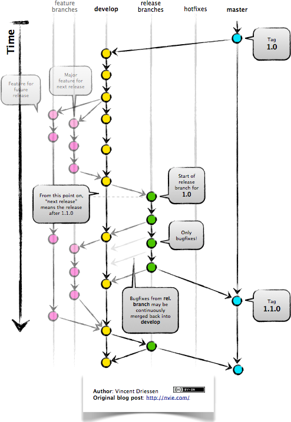

Git使用技巧（ljs）
 
再所有操作之前都需要先拉最新代码
1: 从服务器clone代码
  git clone git@172.172.172.172:member

2: 拉最新代码
  git pull = git fetch + git merge
  git pull --rebase = git pull --rebase = git fetch + git rebase
      # http://www.cnblogs.com/kevingrace/p/5896706.html
      merge: 合并后会产生一个新的commit，commit到upstream后产生一个菱形的network，origin的comit不会被删除。
      rebase: 合并后不会产生一个新的commit，commit到upstream后产生一个直线型的network，origin的comit会被删除。

3: 提交代码
  git add .
  git commit -m "[dalin] fix bug 0322" 
  git push origin HEAD

4: 打TAG
  git tag TAG_20121122
  git push origin TAG_20121122

5: 拉分支
   git pull --rebase
   git branch NewBranchName
   git push -u origin NewBranchName (提交)(参考13)

   git branch -vv  #查看本地分支和远程分支建立的关联关系
   git branch --set-upstream-to=origin/20170826 # 将当前分支和远程分支建立关联关系
   # ===========1===========
   # [t9@t9-Mac nbiz (20170826)]$ git branch -vv   
   # * 20170826         93b7c4ce6 update suggest service
   #   develop          969fe7540 [origin/develop: ahead 23] Merge branch 'develop' into 'develop'
   #   hystrix          9e4a948d5 test
   #   master           90478ff62 [origin/master] 把审核中暴露给user模块
   #   release_20170612 fac086932 [origin/release_20170612] [SHARING-869]商业关系管理
   #   release_20170620 62bdb5ca2 Merge branch 'hotfix' into 'master'
   #   release_20170712 11d3ca173 [upstream/release_20170712] update Sub1&Sub2 for OpenAPI
   # ===========2===========
   # [t9@t9-Mac nbiz (20170826)]$ git branch --set-upstream-to=origin/20170826
   # Branch 20170826 set up to track remote branch 20170826 from origin.
   # ===========3===========
   # [t9@t9-Mac nbiz (20170826)]$ git branch -vv                              
   # * 20170826         93b7c4ce6 [origin/20170826] update suggest service
   #   develop          969fe7540 [origin/develop: ahead 23] Merge branch 'develop' into 'develop'
   #   hystrix          9e4a948d5 test
   #   master           90478ff62 [origin/master] 把审核中暴露给user模块
   #   release_20170612 fac086932 [origin/release_20170612] [SHARING-869]商业关系管理
   #   release_20170620 62bdb5ca2 Merge branch 'hotfix' into 'master'
   #   release_20170712 11d3ca173 [upstream/release_20170712] update Sub1&Sub2 for OpenAPI
   如果不建立关系，报如下错：
   fatal: The current branch 20170826 has no upstream branch.
   To push the current branch and set the remote as upstream, use

6: Merge分支代码
   git pull --rebase
   git checkout master
   git merge STG
   git push origin HEAD

   git checkout upstream/dev_001 MVC.html #当前分支：origin/dev_001 有一个远程仓库upstream，但是文件路径有时需加文件夹

7: 删除分支
    方式1:
       #删除本地分支：
         git branch -D unUsedBranchName（大写：强删，小写：不强删）
       #删除远程分支
         git push origin :dev20121221（冒号+分支名）

       #如果删除时报error: unable to push to unqualified destination
       #尝试以下命令
         git branch -r -d origin/my_remote_branch
    方式2:
      远程
        git push origin --delete dev_20150718_01
      本地
        git branch -D dev_20150709

8: 删除远程TAG
   git push origin :refs/tags/20121221_01

9: 显示TAG/Branch信息
    git branch -a（显示本地+远程所有分支）

    git tag -l(显示本地所有tag)
    git branch -l(显示本地所有branch)
    git show tagName

10: 显示TAG/Branch之间的改动文件
   git diff --name-status newTag..oldTag(好像无效 )

11: 显示远程的tag所有列表
   git ls-remote origin refs/tags

12: 显示远程特定的tag列表
   git ls-remote origin reg*

13: 本地提交所有的tag/branch
   git push origin ref/tags/branch/*

14: 当有tag无法通过git pull命令获取时，请尝试使用下面的命令
  git fetch --tags

15: 当git pull命令出错时，请尝试使用下面的命令
  /* 
  You asked me to pull without telling me which branch you
  want to rebase against, and 'branch.DEV_20130617.merge' in
  your configuration file does not tell me, either. Please  
  specify which branch you want to use on the command line and
  try again (e.g. 'git pull <repository> <refspec>').         
  See git-pull(1) for details.                                

  If you often rebase against the same branch, you may want to
  use something like the following in your configuration file:

      [branch "DEV_20130617"]
      remote = <nickname>    
      merge = <remote-ref>   
      rebase = true          

      [remote "<nickname>"]
      url = <url>          
      fetch = <refspec>    

  See git-config(1) for details.
  */

  git branch --set-upstream DEV_20130617 origin/DEV_20130617

16: 删除一个Git文件和它的历史
  /* 
  * 注意：不到万不得已，不要这么搞哦。这个情况适用于你想删除误提交的文件，比如1G的Log什么的。
  */
    git filter-branch --index-filter 'git rm -r --cached --ignore-unmatch /path/of/file/handover.zip' HEAD
    git push origin master --force
    rm -rf .git/refs/original/
    git reflog expire --expire=now --all
    git gc --prune=now
    git gc --aggressive --prune=now

17: 删除一个push的commit号
  /*
  git会将本次操作执行一次逆操作，然后生成一个新的commit（可以使用get log --stat 查看两者是相反的操作）
  */
  git revert [commit]

18: 提交代码自动增加'#rXXXX'信息
  1: 在PATH中增加一个git-ecr的文件，需要可执行的权限
    文件内容如下

    #!/bin/sh
    ECR_COMMENT=$*
    echo "commit : ECR #$ECR_COMMENT" 
    git commit -m "#r$ECR_COMMENT" 

  2: 使用命令是使用git ecr [ECR号] commit 信息
    git ecr 2425 finished the test case

19: 提交代码自动增加'#bXXXX'信息
  1: 在PATH中增加一个git-bug的文件，需要可执行的权限
    文件内容如下

    #!/bin/sh
    BUG_COMMENT=$*
    echo "commit : fix mantis bug #$BUG_COMMENT" 
    git commit -m "#b$BUG_COMMENT" 

  2: 使用命令是使用git bug [bug号] commit 信息
    git bug 4001 add invoke log

20: Git常用配置
  在命令行执行，进行全局配置项设置

  /*
  git config --global user.name dalin
  git config --global user.email dalin111@qq.com
  git config color.ui true
  */
  git config color.ui true
  git config --global alias.ci commit
  git config --global alias.co checkout
  git config --global alias.st status
  git config --global alias.pl "pull --rebase" 
  git config --global alias.ps "push origin HEAD" 

  git config --list查看设置

21: git在命令行自动提示 未将master merge到当前目录
  ～/.bashrc 增加下面的内容

  black=$'\[\e[1;30m\]'
  red=$'\[\e[1;31m\]'
  green=$'\[\e[1;32m\]'
  yellow=$'\[\e[1;33m\]'
  blue=$'\[\e[1;34m\]'
  magenta=$'\[\e[1;35m\]'
  cyan=$'\[\e[1;36m\]'
  white=$'\[\e[1;37m\]'
  normal=$'\[\e[m\]'

  source ~/.git-completion.sh
  source ~/.git-prompt.sh
  PS1="[$blue\u$normal@\h $cyan\W"$red'$(__git_ps1 "(%s)")'"$normal]\$ " 

  将附件中的git-prompt.sh 放在 ~/ 目录下面，重命名未.git-prompt.sh
  将附件中的git-completion.sh 放在 ~/ 目录下面，重命名未.git-completion.sh

22: 远程信息
  要查看远程库的信息，用git remote：
  $ git remote  //或者，用git remote -v显示更详细的信息：

  $ git remote -v
  origin  git@github.com:michaelliao/learngit.git (fetch)     //可以抓取的origin的地址
  origin  git@github.com:michaelliao/learngit.git (push)      //可以推送的origin的地址,如果没有推送权限，就看不到push的地址。

23: https-git方式互换
  原因是使用了https方式 push

  在termail里边 输入  git remote -v 

  可以看到形如一下的返回结果
  origin https://github.com/torres/demo.git (fetch)
  origin https://github.com/torres/demo.git (push)

  下面把它换成ssh方式的。
  1. git remote rm origin
  2. git remote add origin git@github.com:yuquan0821/demo.git
  3. git push origin 
=================================
=================================

GitRepoStandard
Git库管理规范
基于tag的分支管理-简略版:
（1）新创建的分支Branch命名以DEV_yyyyMMdd的命名方式，如DEV_20140212。
（2）新的TAG分为开发dev、回归reg、修复hot三种，命名方式如：dev_20140212_01
（3）测试过程中可以多次移交给QA进行测试，打dev的TAG。
（4）当进入回归阶段，将dev分支merge到master分支上，并打reg的TAG。
（5）当生产上发现严重BUG需要进行hotfix的时候，先从生产的reg的TAG上拉一个分支，命名为HOT_yyyyMMdd。

基于tag的分支管理-完整版:
(1) 项目或ECR开始，子系统根据计划上线日期创建开发分支， dev_20130319。（ 开发分支基于上线的rel_20130415 Tag ）
(2) 开发移交测试后，在开发分支上打Tag，Tag规则dev_20130319_01 (02, 03 序列增加)
(3) 测试稳定后，测试发出通知进入回归测试。开发把最新内容合并入master分支，Tag规则修改为reg_20130319_01
    （ 序列号重新从01开始 ，记录回归测试交付次数）
(4) 回归测试过程中，如果有Bug，那么在开发分支（dev_20130319）修改，然后代码merge到master，在master上打tag给QA。
(5) 测试完成后，测试发出测试完成报告，开发在最后Tag上打上版本发布标签rel_20130319
(6) 测试报告 使用 reg的tag
(7) 对线上问题修复，运维须提供当前线上发布的标签，开发基于这个标签建立HOTFIX分支
(8) 如果HOTFIX同时存在回归版本，此时版本只能在hotfix上发布（异常流程）
(9) HOTFIX 分支名字 规则以hot开头，如hot_XXXXXXX 各种测试reg、rel的tag都在当前hot分支上打,也分别以 hot_XXXXXX_XX 来区分

基于分支的分支管理:
核心是在relead分支上deploy -> test -> fix -> redeploy -> retest :
  
  
============================
============================
C端 command list
安装C端命令集

git clone git@172.17.40.1:utility ~/.dalin
echo 'source ~/.dalin/command/dalinEnv.sh' >> ~/.bashrc

关闭terminal后重新打开就可以使用了

如果现有terminal也想使用
可以使用下面的命令

====================================================================================
===================================gitlab===========================================
====================================================================================
http://www.jianshu.com/p/9fd449340ea5
fork:
  1.查看是否有远程分支: git remote -v
    origin  http://10.199.192.11/torres/nbiz.git (fetch)
    origin  http://10.199.192.11/torres/nbiz.git (push)
  2.如果没有需要添加远程的fork之前的原仓库: git remote add upstream http://10.199.192.11/business-platform/nbiz.git
    git remote -v: 
      origin  http://10.199.192.11/torres/nbiz.git (fetch)
      origin  http://10.199.192.11/torres/nbiz.git (push)
      upstream  http://10.199.192.11/business-platform/nbiz.git (fetch)
      upstream  http://10.199.192.11/business-platform/nbiz.git (push)
    --删除remote的upstream标签: git remote rm upstream
  3.获得原仓库最新代码: git pull upstream master (git fetch upstream + git merge upstram/master) 
    --比较和远程原仓库区别: git diff master upstream/master
  4.提交代码: git add -->> git commit -a -m"commit" -->> git push origin master(git push)
  5.发起pull request: gitlab/github网站上操作

git reset [file]: 把index区域的文件保留修改返回的workspace区域
====================================================================================
===================================push后解决冲突技巧==================================
====================================================================================
git reset HEAD~3 # 3:本次提交的次数
git stash 
git pull --rebase upstream master
git stash pop
解决冲突后重新提交、push

