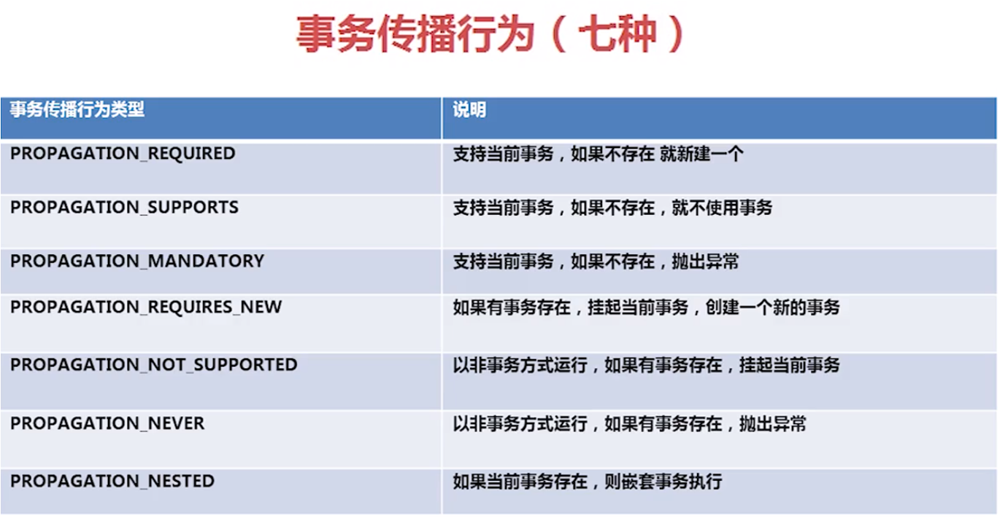

1: 事务隔离级别 # 所有的可重复读、脏读、幻读都是指B事务是否可以读取到A事务操作的数据
    * READ_UNCOMMITTED(读取未提交内容): 这是事务最低的隔离级别，它充许令外一个事务可以看到这个事务未提交的数据。这种隔离级别会产生脏读，不可重复读
                                      和幻像读。 
                                      # 会脏读
                                      # 会幻读
                                      # 不可重复读
                                      # 级别最低
    * READ_COMMITTED(读取提交内容): 保证一个事务修改的数据提交后才能被另外一个事务读取。另外一个事务不能读取该事务未提交的数据（不可重复读），意味
                                  着我们在同一个事务中执行完全相同的select语句时可能看到不一样的结果。（中间发生了commit）
                                      # 不会脏读
                                      # 会幻读
                                      # 不可重复读（针对其他食物中两个相同的select而言）
                                      # ---Oracle默认的隔离级别
    * REPEATABLE_READ(可重复读): 这种事务隔离级别可以防止脏读，不可重复读。但是可能出现幻读。保证一个事务不能读取另一个事务未提交的数据外，还保证
                                了避免下面的情况产生(不可重复读)-A中的两次读取数据一致，中间不会读取到B提交的数据。
                                      # 不会脏读
                                      # 会幻读(读到的和实际的不一样)
                                      # 可重复读
                                      # ---Mysql默认的级别
    * SERIALIZABLE(可串行化): 这是花费最高代价但是最可靠的事务隔离级别。事务被处理为顺序执行。 
                                      # 不会脏读
                                      # 不会幻读
                                      # 可重复读
                                      # 级别最高
    不可重复读与幻读的区别:
      *脏读的重点是读另一个事务未提交的数据: A事务更新一份数据, B事务在此时读取了同一份数据, 由于某些原因A RollBack了, 则B事务读取的数据就是不正确的
      *不可重复读的重点是修改: 同样的条件, 你读取过的数据, 再次读取出来发现值不一样了
      *幻读的重点在于新增或者删除: 简单的说，幻读指A事务读取某一范围的数据行时，B事务在该范围内插入了新行，A再读取该范围的数据行时，发现有新的“幻影” 行
      当然, 从总的结果来看, 似乎两者都表现为两次读取的结果不一致, 但如果你从控制的角度来看, 两者的区别就比较大, 对于不可重复读, 只需要锁住满足条件的记
      录, 对于幻读, 要锁住满足条件及其相近的记录
    
2: spring transaction
    

3: double transaction
    # @Autowired
    # @Qualifier("transactionManagerBls")
    # private PlatformTransactionManager transactionManagerBls;
    # 
    # 
    #     public static TransactionStatus createTrans(PlatformTransactionManager transManager) {
    #         TransactionDefinition transDef = new DefaultTransactionDefinition(TransactionDefinition.PROPAGATION_REQUIRED);
    #         return transManager.getTransaction(transDef);
    #     }
    # 
    #     public static void commitTrans(PlatformTransactionManager transManager, TransactionStatus status) {
    #         transManager.commit(status);
    #     }
    # 
    #     public static void rollbackTrans(PlatformTransactionManager transManager, TransactionStatus status) {
    #         transManager.rollback(status);
    #     }
    # 
    # 
    # 
    # org.springframework.transaction.TransactionStatus statusBls = createTrans(transactionManagerBls);
    # org.springframework.transaction.TransactionStatus statusEbkb = createTrans(transactionManagerBls);
    # 
    # commitTrans(transactionManagerBls, statusBls);
    # commitTrans(transactionManagerEbkb, statusEbkb);
    # 
    # rollbackTrans(transactionManagerBls, statusBls);
    # rollbackTrans(transactionManagerEbkb, statusEbkb);
    # 
    # 
    # 
    # 
    # //ÊÖ¶¯
    # TransactionAspectSupport.currentTransactionStatus().setRollbackOnly();# 