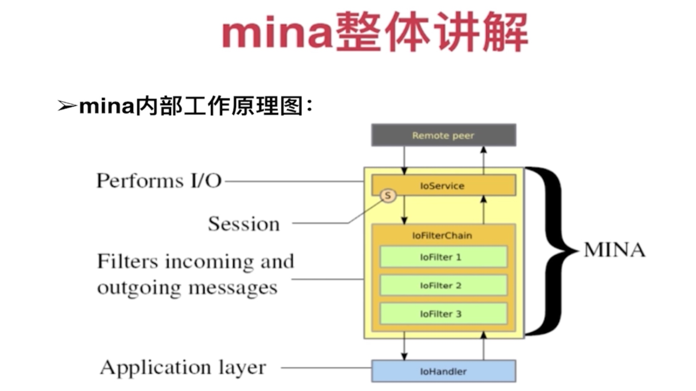
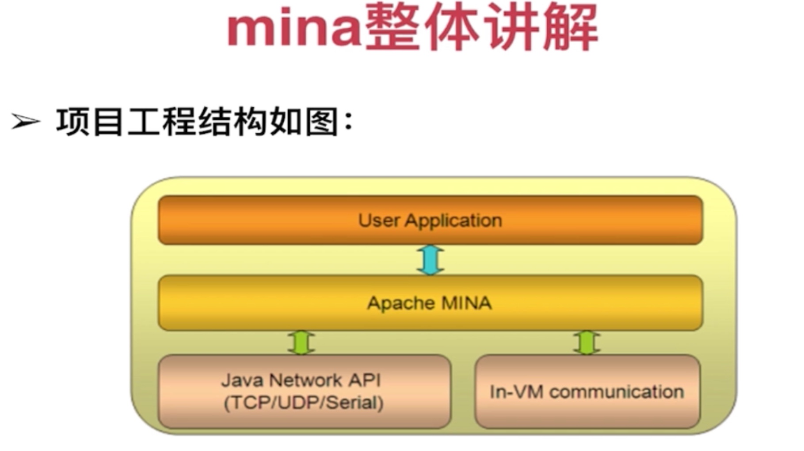
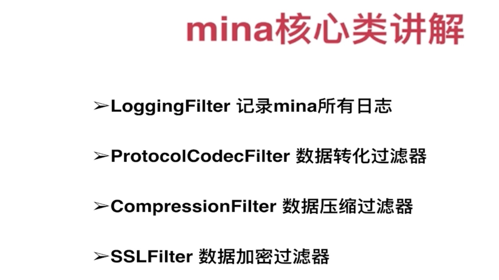
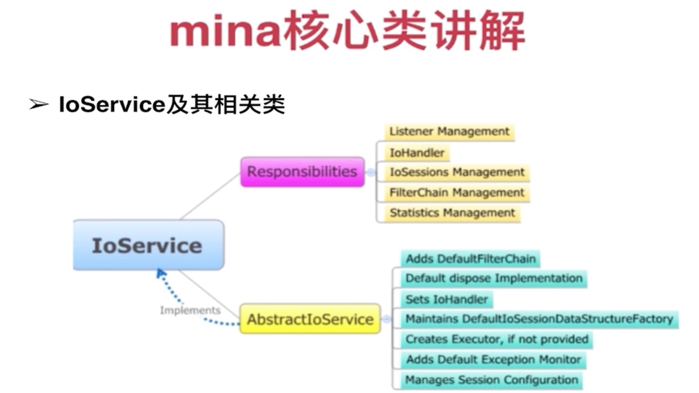
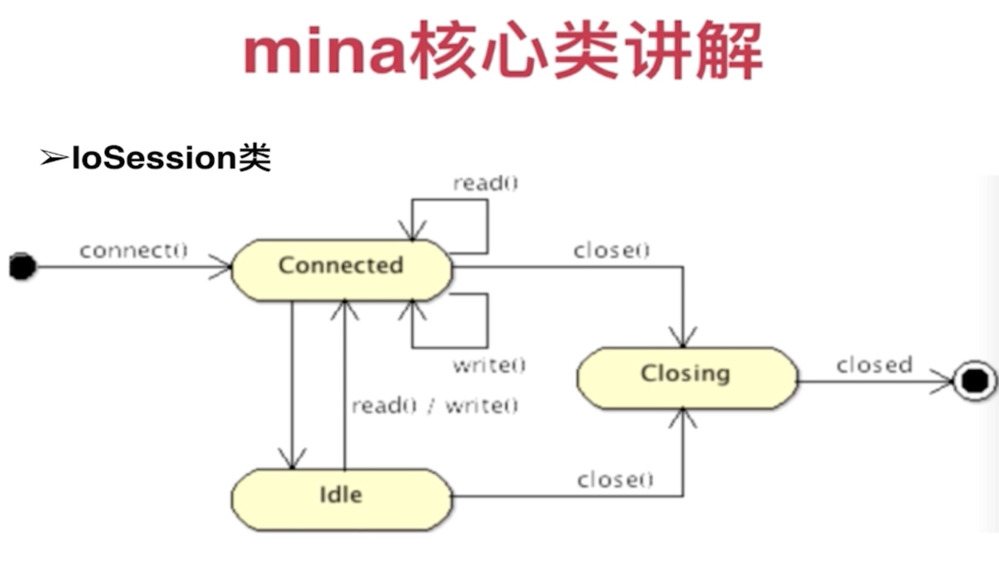

mina与netty都是Trustin Lee的作品，所以在很多方面都十分相似
# http://ifeve.com/netty-mina-in-depth-1/
系统框架:
  整个系统由两个服务端程序和两个客户端程序组成。分别实现TCP长连接和短连接通信。系统业务逻辑是一个客户端与服务端建立长连接，一个客户端与服务
  端建立短连接。数据从短连接客户端经过服务端发送到长连接客户端，并从长连接客户端接收响应数据。当收到响应数据后断开连接。

这个框架的优点:
  * 异步 
  * 无阻塞 
  * 事件驱动 
  * 支持TCP, UDP, APR, 串口… 
  * 通过 过滤器（Filters）实现扩展性 
  * 同时提供协议框架

Apache开源的基于TCP/UDP的长链接项目（mina长链接实现原理：socket（client）—> server socket监听（server）），区别于XMTP；不同于支持
gzip压缩的、短链接的 http，http新建、断开导致效率低，而okhttp只是缓存了链接对象。
其核心部分架构是这样的:
    
内部可以分为3 个层次: 
    I/O Service: 执行实际的I / O，可以选择现成的Services如 (*Acceptor)，也可以自己写。
    I/O Filter Chain: 这是一个由多个过滤器组成的过滤器链，在这个环节将字节数据转换到特定的数据结构中（Filters/Transforms bytes 
                      into desired Data Structures and vice-versa） 
    I/O Handler: 实际的业务逻辑部分
    
    
可以通过实现mina接口实现自定义过滤器，但是一般不用
    
    

