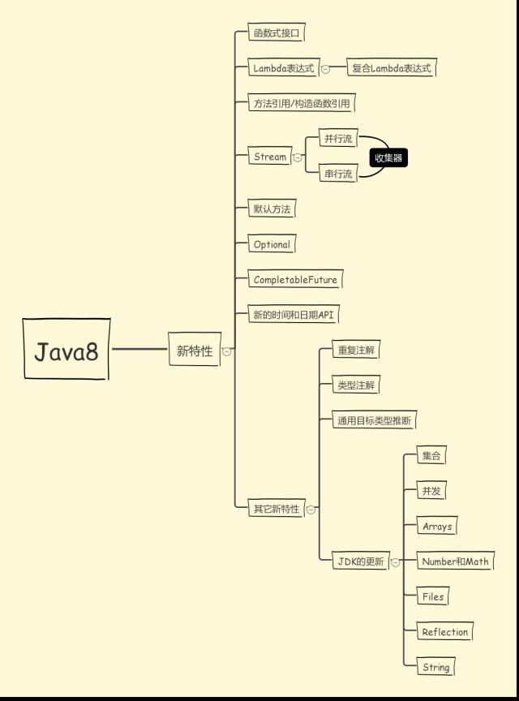
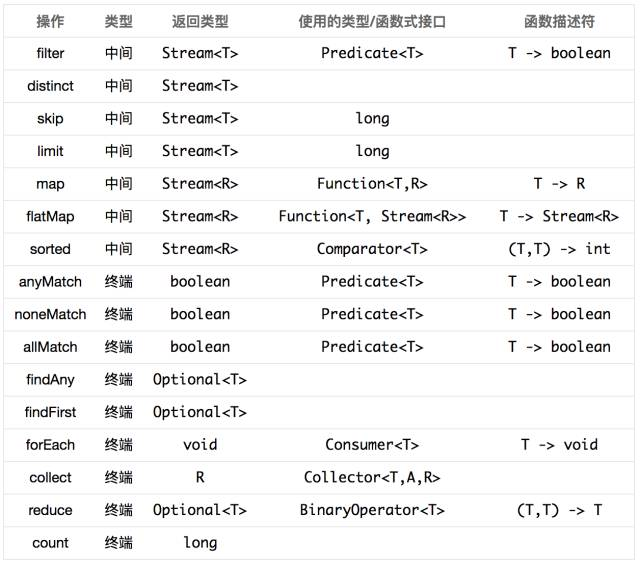

1: Java 8
    
    1.1: 语言新特性:
      * Lambda表达式与Functional接口
      * 接口的默认与静态方法
      * 方法引用
      * 更好的类型推测机制
      
      补充: 
      1. 其实函数式接口的表中的函数描述符就是Lambda表达式，在函数式接口中Lambda表达式相当于匿名内部类的效果。 
      # http://listenzhangbin.com/post/2017/01/java8-learning-notes/
      
      2. 接口的静态方法和默认方法
        Function是一个接口，那么Function.identity()是什么意思呢？这要从两方面解释：
        a. Java 8允许在接口中加入具体方法。接口中的具体方法有两种，default方法和static方法，identity()就是Function接口的一个静态方法。
        b. Function.identity()返回一个输出跟输入一样的Lambda表达式对象，等价于形如t -> t形式的Lambda表达式。
        
        默认方法的使用相对来说比较简单，唯一要注意的点是如何处理默认方法的冲突。关于如何处理默认方法的冲突可以参考以下三条规则：
        a. 类中的方法优先级最高。类或父类中声明的方法的优先级高于任何声明为默认方法的优先级。
        b. 如果无法依据第一条规则进行判断，那么子接口的优先级更高：函数签名相同时，优先选择拥有最具体实现的默认方法的接口。即如果B继承了A，那么B就
          比A更具体。
        c. 最后，如果还是无法判断，继承了多个接口的类必须通过显式覆盖和调用期望的方法，显式地选择使用哪一个默认方法的实现。那么如何显式地指定呢：
          public class C implements B, A {
              public void hello() {
                  B.super().hello();    
              }
          }
          
        
        上面的解释是不是让你疑问更多？不要问我为什么接口中可以有具体方法，也不要告诉我你觉得t -> t比identity()方法更直观。我会告诉你接口中的
        default方法是一个无奈之举，在Java 7及之前要想在定义好的接口中加入新的抽象方法是很困难甚至不可能的，因为所有实现了该接口的类都要重新实现。
        试想在Collection接口中加入一个stream()抽象方法会怎样？default方法就是用来解决这个尴尬问题的，直接在接口中实现新加入的方法。既然已经引入
        了default方法，为何不再加入static方法来避免专门的工具类呢！
      
      3. 方法引用
        诸如String::length的语法形式叫做方法引用（method references），这种语法用来替代某些特定形式Lambda表达式。如果Lambda表达式的全部内容
        就是调用一个已有的方法，那么可以用方法引用来替代Lambda表达式。方法引用可以细分为四类：
    
      

    1.2: 类库新特性:
      * Optional
      * Streams
      * Date/Time API (JSR 310)
      * JavaScript引擎Nashorn
      * Base64
      * 并行（parallel）数组
      * 并发（Concurrency）

    1.3: Java虚拟机（JVM）的新特性
      PermGen空间被移除了，取而代之的是Metaspace（JEP 122）。JVM选项-XX:PermSize与-XX:MaxPermSize分别被-XX:MetaSpaceSize与
      -XX:MaxMetaspaceSize所代替。

      关于Java8中JVM 把PermGen（永久代）换成Metespace（元空间）的思考:
      #http://m.blog.csdn.net/zhushuai1221/article/details/52122880
      #http://m.blog.csdn.net/hsk256/article/details/49104955

    1.4: Stream # Stream不是一种数据结构，它只是某种数据源的一个视图
        
        Stream提供了非常丰富的操作，包括筛选、切片、映射、查找、匹配、归约等等， 这些操作又可以分为中间操作和终端操作，中间操作
        (intermediate operations)和结束操作(terminal operations)
        
        forEach():
          void forEach(Consumer<? super E> action)，作用是对容器中的每个元素执行action指定的动作
          Stream<String> stream = Stream.of("I", "love", "you", "too");
          stream.forEach(str -> System.out.println(str));

        filter():
          返回一个只包含满足predicate条件元素的Stream。

        distinct():

        sorted():
          Stream<String> stream= Stream.of("I", "love", "you", "too");
          stream.sorted((str1, str2) -> str1.length()-str2.length())
              .forEach(str -> System.out.println(str));

        map():
          返回一个对当前所有元素执行执行mapper之后的结果组成的Stream
          Stream<String> stream　= Stream.of("I", "love", "you", "too");
          stream.map(str -> str.toUpperCase())
              .forEach(str -> System.out.println(str));

        flatMap():
          每个元素执行mapper指定的操作，并用所有mapper返回的Stream中的元素组成一个新的Stream作为最终返回结果。
          Stream<List<Integer>> stream = Stream.of(Arrays.asList(1,2), Arrays.asList(3, 4, 5));
          stream.flatMap(list -> list.stream())
              .forEach(i -> System.out.println(i));

        规约操作（reduction operation）: 又被称作折叠操作（fold），是通过某个连接动作将所有元素汇总成一个汇总结果的过程。元素求和、求最大值
          或最小值、求出元素总个数、将所有元素转换成一个列表或集合，都属于规约操作。Stream类库有两个通用的规约操作reduce()和collect()，也有
          一些为简化书写而设计的专用规约操作，比如sum()、max()、min()、count()等。

        多面手reduce(): 
          reduce操作可以实现从一组元素中生成一个值，sum()、max()、min()、count()等都是reduce操作，将他们单独设为函数只是因为常用。
          * Optional<T> reduce(BinaryOperator<T> accumulator)
          * T reduce(T identity, BinaryOperator<T> accumulator)
          * <U> U reduce(U identity, BiFunction<U,? super T,U> accumulator, BinaryOperator<U> combiner)
          虽然函数定义越来越长，但语义不曾改变，多的参数只是为了指明初始值（参数identity），或者是指定并行执行时多个部分结果的合并方式（参数
          combiner）。reduce()最常用的场景就是从一堆值中生成一个值（求单词长度之和）。用这么复杂的函数去求一个最大或最小值，你是不是觉得设计
          者有病。其实不然，因为“大”和“小”或者“求和”有时会有不同的语义。

          Stream<String> stream = Stream.of("I", "love", "you", "too”);
          Optional<String> longest = stream.reduce((s1, s2) -> s1.length()>=s2.length() ? s1 : s2);
          //如果Steam中有null，会报空指针错误，需要加一句话：stream = stream.filter(str -> str != null);
          //Optional<String> longest = stream.max((s1, s2) -> s1.length()-s2.length());
          System.out.println(longest.get());

          // 求单词长度之和
          Stream<String> stream = Stream.of("I", "love", "you", "too");
          Integer lengthSum = stream.reduce(0,　// 初始值　// (1)
                  (sum, str) -> sum+str.length(), // 累加器 // (2)
                  (a, b) -> a+b);　// 部分和拼接器，并行执行时才会用到 // (3)
          // int lengthSum = stream.mapToInt(str -> str.length()).sum();
          System.out.println(lengthSum);
          上述代码标号(2)处将i. 字符串映射成长度，ii. 并和当前累加和相加。这显然是两步操作，使用reduce()函数将这两步合二为一，更有助于提升性
          能。如果想要使用map()和sum()组合来达到上述目的，也是可以的。

        终极武器collect() :
          collect()是Stream接口方法中最灵活的一个，学会它才算真正入门Java函数式编程。
          // 将Stream转换成容器或Map
          Stream<String> stream = Stream.of("I", "love", "you", "too");
          List<String> list = stream.collect(Collectors.toList()); 
          // Set<String> set = stream.collect(Collectors.toSet()); 
          // Map<String, Integer> map = stream.collect(Collectors.toMap(Function.identity(), String::length)); 

        收集器:
        
 a.使用collect()生成Collection:
            // 将Stream转换成List或Set
            Stream<String> stream = Stream.of("I", "love", "you", "too");
            List<String> list = stream.collect(Collectors.toList()); // (1)
            Set<String> set = stream.collect(Collectors.toSet()); // (2)

            // 使用toCollection()指定规约容器的类型
            ArrayList<String> arrayList = stream.collect(Collectors.toCollection(ArrayList::new));// (3)
            HashSet<String> hashSet = stream.collect(Collectors.toCollection(HashSet::new));// (4)

          b.使用collect()生成Map:
            前面已经说过Stream背后依赖于某种数据源，数据源可以是数组、容器等，但不能是Map。反过来从Stream生成Map是可以的，但我们要想清楚Map的key和value分别代表什么，根本原因是我们要想清楚要干什么。通常在三种情况下collect()的结果会是Map：
            1. 使用Collectors.toMap()生成的收集器，用户需要指定如何生成Map的key和value。
            2. 使用Collectors.partitioningBy()生成的收集器，对元素进行二分区操作时用到。
            3. 使用Collectors.groupingBy()生成的收集器，对元素做group操作时用到。

              // 使用toMap()统计学生GPA
              Map<Student, Double> studentToGPA = students.stream().collect(Collectors.toMap(Functions.identity(),// 如何生成key
                                                 student -> computeGPA(student)));// 如何生成value

              // Partition students into passing and failing
              Map<Boolean, List<Student>> passingFailing = students.stream().collect(Collectors.partitioningBy(s -> s.getGrade() >= PASS_THRESHOLD));

              // Group employees by department
              Map<Department, List<Employee>> byDept = employees.stream().collect(Collectors.groupingBy(Employee::getDepartment));
              // 使用下游收集器统计每个部门的人数
              Map<Department, Integer> totalByDept = employees.stream().collect(Collectors.groupingBy(Employee::getDepartment, Collectors.counting()));// 下游收集器

            上面代码的逻辑是不是越看越像SQL？高度非结构化。还有更狠的，下游收集器还可以包含更下游的收集器，这绝不是为了炫技而增加的把戏，而是实际场景需要。考虑将员工按照部门分组的场景，如果我们想得到每个员工的名字（字符串），而不是一个个Employee对象，可通过如下方式做到：
            // 按照部门对员工分布组，并只保留员工的名字
            Map<Department, List<String>> byDept = employees.stream()
                            .collect(Collectors.groupingBy(Employee::getDepartment,
                                    Collectors.mapping(Employee::getName,// 下游收集器
                                            Collectors.toList())));// 更下游的收集器

          c.使用collect()做字符串join:
            这个肯定是大家喜闻乐见的功能，字符串拼接时使用Collectors.joining()生成的收集器，从此告别for循环。Collectors.joining()方法有三种重写形式，分别对应三种不同的拼接方式。无需多言，代码过目难忘。

            // 使用Collectors.joining()拼接字符串
            Stream<String> stream = Stream.of("I", "love", "you");
            //String joined = stream.collect(Collectors.joining());// "Iloveyou"
            //String joined = stream.collect(Collectors.joining(","));// "I,love,you"
            String joined = stream.collect(Collectors.joining(",", "{", "}"));// "{I,love,you}"


2: Java 9 
  9个新特性:
    * Java 平台级模块系统
    * Linking
    * JShell : 交互式 Java REPL
    * 改进的 Javadoc
    * 集合工厂方法
    * 改进的 Stream API
    * 私有接口方法
    * HTTP/2
    * 多版本兼容 JAR
