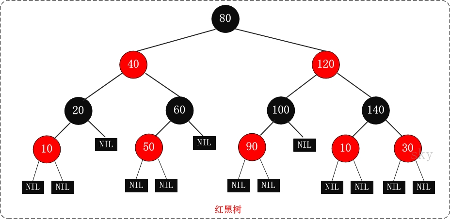
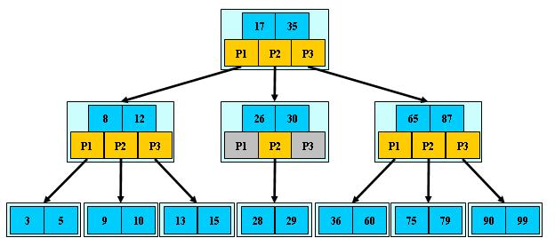
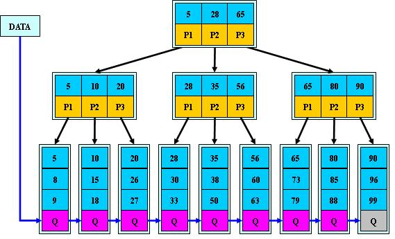

叶子节点: 最下层节点
B: 通常认为是Balance的简称

1.二叉树（Binary Tree）:
  在实际使用时会根据链表和有序数组等数据结构的不同优势进行选择。有序数组的优势在于二分查找，链表的优势在于数据项的插入和数据项的删除。但是
  在有序数组中插入数据就会很慢(数组的内存地址是连续的)，同样在链表中查找数据项效率就很低。综合以上情况，二叉树可以利用链表和有序数组的优势
  ，同时可以合并有序数组和链表的优势，二叉树也是一种常用的数据结构。
  二叉树的特性:
    (1) 每个节点最多有两个子树的树结构。
    (2) 左、右子节点不一定比父节点小、大。

  二叉查找树（BST，Binary Search Tree）: 
    (1) 若任意节点的左子树不空，则左子树上【所有】结点的值均小于等于它的根结点的值；
    (2) 任意节点的右子树不空，则右子树上【所有】结点的值均大于等于它的根结点的值；
    (3) 任意节点的左、右子树也分别为二叉查找树。

2.红黑树: (Red-Black Tree，简称R-B Tree)（TreeMap、TreeSet、ConcurrentHashmap、Linux的epoll）
    
    又称红-黑二叉树，是一颗二叉树，有二叉树所有的特性，且红黑树是一颗自平衡的排序二叉树(平衡二叉树的一种实现方式)。也可以看成B树的一种。解决了极端情
  况下二叉树变成链表（所有节点都只有左节点或者右节点），导致检索效率大大降低（O(n)）的问题。
  # 平衡二叉树：是一棵空树或左右两个子树高度差的绝对值不超过1，且左右两个子树都是一棵平衡二叉树。即该二叉树的任何一个子节点，其左右子树的高度都相近
  红黑树的特性:
    (1) 每个节点或者是黑色，或者是红色。
    (2) 根节点是黑色。
    (3) 每个叶子节点是黑色。 [注意：P这里叶子节点，是指为空的叶子节点！]
    (4) 如果一个节点是红色的，则它的子节点必须是黑色的。
    (5) 从一个节点到该节点的子孙节点的所有路径上包含相同数目的黑节点。（因而，红黑树是相对是接近平衡的二叉树。why？）
  # java8中的concurrenthashmap发生hash碰撞后存链表尾部，如果长度大于8就把链表换成红黑树。

  红黑树的操作: 
    坐旋转、右旋转: 左、右子节点提升到父节点位置，父节点降低为右、左子节点。
    变色: 旋转后保证满足红黑树的特性

3.各种树: 
  AVL树: 最早的平衡二叉树之一。应用相对其他数据结构比较少。windows对进程地址空间的管理用到了AVL树。
  红黑树: 平衡二叉树，广泛用在C++的STL中。如map和set都是用红黑树实现的。
  B/B+树: 用在磁盘文件组织 数据索引和数据库索引。
  Trie树(字典树): 用在统计和排序大量字符串，如自动机。

  B-树即BTree: # 并不是二叉的
  
  B-树通常存储在磁盘上， 则前一查找操作是在磁盘上进行的，而后一查找操作是在内存中进行的。是一种多路搜索树： 
     1.定义任意非叶子结点最多只有M个儿子；且M>2；（3）
     #2.根结点的儿子数为[2, M]；
     #3.除根结点以外的非叶子结点的儿子数为[M/2, M]；
     4.每个结点存放至少M/2-1（取上整）和至多M-1个关键字；（至少2个关键字）（蓝色：3/-1至3-1个）
     5.非叶子结点的关键字个数=指向儿子的指针个数-1；（蓝色=黄色-1）
     #6.非叶子结点的关键字：K[1], K[2], …,K[M-1]；且K[i] < K[i+1]；
     7.非叶子结点的指针：P[1], P[2], …, P[M]；其中P[1]指向关键字小于K[1]的子树，P[M]指向关键字大于K[M-1]的子树，其它P[i]指向关键字属于(K[i-1], K[i])的子树；
     8.所有叶子结点位于同一层；

  B+树:
  
  B+树是B-树的变体，也是一种多路搜索树：
     1.其定义基本与B-树同，除了：
     2.非叶子结点的子树指针与关键字个数相同；
     3.非叶子结点的子树指针P[i]，指向关键字值属于[K[i], K[i+1])的子树（B-树是开区间）；
     5.为所有叶子结点增加一个链指针； # 主要区别与B-的一点
     6.所有关键字都在叶子结点出现；

4.B+  VS  B-:
  　　它们特点是一样的，是多路查找树，一般用于数据库系统中，为什么，因为它们分支多层数少呗、降低了树的高度，都知道磁盘IO是非常耗时的，而像大量数据存储在
  磁盘中所以我们要有效的减少磁盘IO次数避免磁盘频繁的查找。

  B+树的有效内容均在叶子节点，B-树的有效内容不全在叶子节点上
  B+树的头指针有两个，一个指向根节点，另一个指向关键字最小的元素，因此B+树有两种遍历的方式：
  1.从根节点开始随机查询
  2.从最小关键词顺序查询
  #B+：http://p.blog.csdn.net/images/p_blog_csdn_net/manesking/6.JPG
  #B-：http://p.blog.csdn.net/images/p_blog_csdn_net/manesking/4.JPG

5.为什么说B+树比B树更适合实际应用中操作系统的文件索引和数据库索引:
  B+树的磁盘读写代价更低。
    B+树的内部结点并没有指向关键字具体信息的指针。因此其内部结点相对B 树更小。如果把所有同一内部结点的关键字存放在同一盘块中，那么盘块所能容纳
    的关键字数量也越多。一次性读入内存中的需要查找的关键字也就越多。相对来说IO读写次数也就降低了。 # 参考B+和B-的区别
  B+树的查询效率更加稳定
    由于非终结点并不是最终指向文件内容的结点，而只是叶子结点中关键字的索引。所以任何关键字的查找必须走一条从根结点到叶子结点的路。所有关键字查
    询的路径长度相同，导致每一个数据的查询效率相当。可以这样理解：root节点到每个叶子结点路径相同，因为所有数据都放在叶子结点。

总结：二叉树添加比数组块，查找比链表块；红黑树是近似平衡树，解决了极端二叉树的情况；B+多了一个独立的路径，且存储空间更小，适合做索引的数据结构。

Ref:
# https://blog.csdn.net/qq_17612199/article/details/50944413