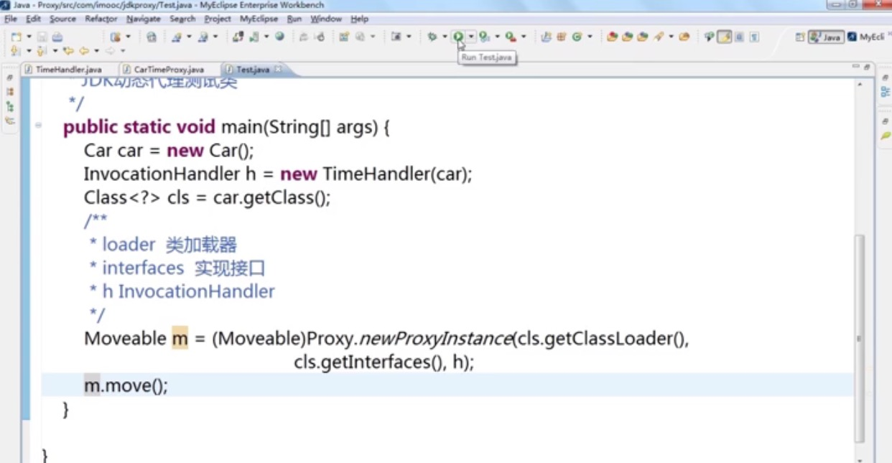

【技术-proxy】
Spring MVC  Transaction 
聚合代理：实现了接口(JDK Proxy) - 实现目标类的接口
继承代理：没实现接口(Cglib) -  继承目标类

聚合:
    
继承:
    

>>>>>>>>>>>>>>>>>>>>>>>>>>>>>>>>>>>>>>
所以建议继承一个借口（聚合代理），这样可以实现不同功能的代理之间任意顺序的组合。（参考慕课网代理模式）（核心代码：代理类里的成员变量是接口本身）
>>>>>>>>>>>>>>>>>>>>>>>>>>>>>>>>>>>>>>

JDK Proxy:
    
    


Cglib Proxy:
    
    


