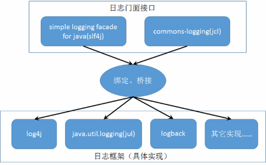

1: sl4j,common-logging,log4j,logback
  日志门面接口：sl4j,common-logging
  日志门面实现：log4j,logback,jul
  

2: logback | Spring Cloud Q&A :
  一个module中多个Controller的method共用一个注册中心的service-name？每个method中的requestMapping不能相同？Restful风格。
  #http://bbs.springcloud.cn/d/1-dd-spring-cloud

  热部:
    <build>

      <plugins>

        <plugin>

          <groupId>org.springframework.boot</groupId>
          <artifactId>spring-boot-maven-plugin</artifactId>
          <dependencies>

            <dependency>

              <groupId>org.springframework</groupId>
              <artifactId>springloaded</artifactId>
              <version>1.2.1.release</version>
              
</dependency>
            
</dependencies>
          
</plugin>
        
</plugins>
    
</build>

  Log:
    根节点<configuration>的子节点：
    
    还有用来定义变量的<property>标签:
  <appender>: 是输出日志的方式

  <loger>: 是具体日志输出器。用来设置某一个包或者具体的某一个类的日志打印级别、以及指定<appender>。<loger>仅有一个name属性，一个可选的level和一
           个可选的addtivity属性。如果某些属性不设置默认继承<root>的。<loger>可以包含零个或多个<appender-ref>元素，标识这个appender将会添加到
           这个loger。 
    - name: 用来指定受此loger约束的某一个包或者具体的某一个类。
    - level: 用来设置打印级别，大小写无关：TRACE, DEBUG, INFO, WARN, ERROR, ALL 和 OFF，还有一个特俗值INHERITED或者同义词NULL，代表强制执行
            上级的级别。如果未设置此属性，那么当前loger将会继承上级的级别。
    - addtivity: 是否向上级loger传递打印信息。默认是true。

  <root>: 也是<loger>元素，但是它是根loger。<root>可以包含零个或多个<appender-ref>元素，标识这个appender将会添加到这个loger。appender被添加到
          root和logger的效果一样。logger如果有level属性就会覆盖继承日志器（比如根日志器)的level属性。而appender会叠加，即本logger的配置的
          appender加上继承日志器上的appender。
          - level: 用来设置打印级别(大小写无关)TRACE, DEBUG, INFO, WARN, ERROR, ALL和OFF，不能设置为INHERITED或者同义词NULL。默认是DEBUG。

  注: logback接收Logevent后默认执行AsyncAppender，AsyncAppender会调用appender方法。logback虽然是异步的，但是在内核态通过用户态往磁盘写数据之
      前，消息会被put到一个ArrayBlockingQueue里，这个过程有可能是阻塞的。原因：这个缓冲丢列的discardingThreshold设置为0说明永远不会丢弃日志
      level TRACE, DEBUG or INFO的日志，只要discardingThreshold>0，则当队列快满时候level TRACE, DEBUG or INFO的日志就会丢弃掉，但是如果丢
      失后打印的是warn级别的日志且依然量级很大那？还是会在put的时候阻塞。如果设置了neverBlock=true则写日志队列时候会调用ArrayBlockingQueue对的
      offer方法而不是put，而offer是非阻塞的，如果队列满则直接返回（非阻塞），而不是被挂起当前线程（阻塞。

  logback原理:
  # http://blog.csdn.net/zhuyucheng123/article/details/21524549
  # http://ifeve.com/%E5%BC%82%E6%AD%A5%E6%89%93%E5%8D%B0%E6%97%A5%E5%BF%97%E7%9A%84%E4%B8%80%E7%82%B9%E4%BA%8B/

3: logback
  # logback config
# You cannot use extensions in the standard logback-spring.xml configuration file since it’s loaded too early.

  # You need to either use logback-spring.xml or define a logging.config property.
# path不以'/'开头时，默认是从此类所在的包下取资源；

  # path以'/'开头时，则是从项目的ClassPath根下获取资源。在这里'/'表示ClassPath

  # Class.getResource和ClassLoader.getResource的区别
logging:
    config: classpath:logback-spring.xml

  在springcloud的application.yml中不写以上配置也行
  springcloud会默认查找

