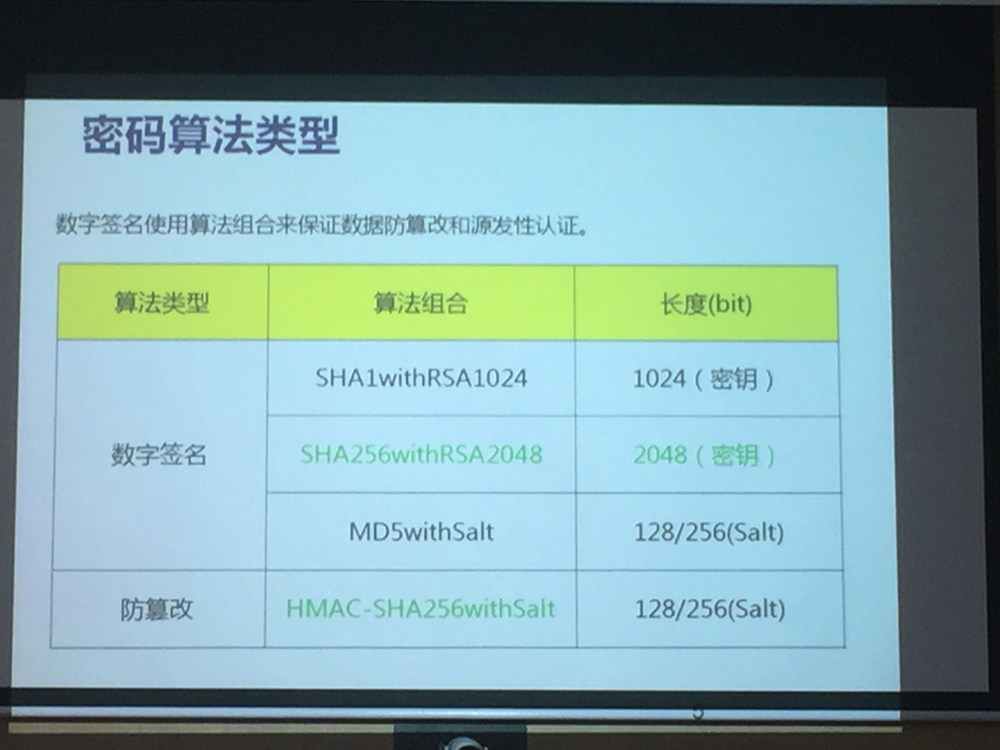

#http://blog.csdn.net/leexide/article/details/17252369
■ 公钥认证的基本思想:
    对信息的加密和解密采用不同的key，这对key分别称作private key和public key，其中，public key存放在欲登录的服务器上，而private key为特定
    的客户机所持有。当客户机向服务器发出建立安全连接的请求时，首先发送自己的public key，如果这个public key是被服务器所允许的，服务器就发送一个
    经过public key加密的随机数据给客户机，这个数据只能通过private key解密，客户机将解密后的信息发还给服务器，服务器验证正确后即确认客户机是可
    信任的，从而建立起一条安全的信息通道。通过这种方式，客户机不需要向外发送自己的身份标志“private key”即可达到校验的目的，并且private key是
    不能通过public key反向推断出来的。这避免了网络窃听可能造成的密码泄露。客户机需要小心的保存自己的private key，以免被其他人窃取，一旦这样的
    事情发生，就需要各服务器更换受信的public key列表。

#https://docs.oracle.com/cd/E19900-01/820-0847/6ncidmgia/index.html(Oracle 证书和 SSL 简介)
■ SSL 握手:
当 Web 浏览器（客户机）需要与某个安全站点建立连接时，则会发生 SSL 握手
●浏览器将通过网络发送请求安全会话的消息（通常请求以 https 而非 http 开头的 URL,包含本地支持的加密算法及密钥长度等）。
●服务器通过发送其证书（包括公钥）进行响应(SSL版本／加密组件、公开密钥证书的Certificate报文)
  #---SSL握手协商部分结束---#
●浏览器将检验服务器的证书是否有效，并检验该证书是否是由其证书位于浏览器的数据库中的（并且是可信的）CA 所签发的。它还将检验 CA 证书是否已过期。
●如果证书有效，浏览器将生成一个一次性的、唯一的会话密钥，并使用服务器的公钥对该会话密钥进行加密。
  然后，浏览器将把加密的会话密钥发送给服务器，这样服务器和浏览器都有一份会话密钥。
●服务器可以使用其专用密钥对消息进行解密、验证消息的完整性、正确性，然后恢复会话密钥。发送Change Cipher Spec 和 Finished报文，建立SSL链接

握手之后，即表示客户机已检验了 Web 站点的身份，并且只有该客户机和 Web 服务器拥有会话密钥副本。从现在开始，客户机和服务器便可以使用该会话密钥对
彼此间的所有通信进行加密。这样就确保了客户机和服务器之间的通信的安全性。

PS:公钥、秘钥可以相互解密，但是因为公、秘钥采用非对称算法，所以根据公钥不能推出秘钥，可以保证安全，可以确保被公钥解密的数据一定数秘钥持有者发出的。
   (可逆，说的是用私钥可解开公钥加密的文件，反之亦然 )

#http://www.cnblogs.com/zhaoyl/archive/2013/01/27/2878832.html
■【数字签名】: 通过对称加密算法加密其文件（非对称密码算法有两个缺点:加密速度慢,比对称加密算法慢10〜100倍，因此只可用其加密小数据(如对称密钥)，
  另外加密后会导致得到的密文变长。因此一般采用对称加密算法加密其文件,然后用非对称算法加密对称算法所用到的对称密钥），再通过非对称算法加密其对称
  密钥,又通过散列算法(如MD5、SHA-1等算法从大块的数据中提取一个摘要)证明其发送者身份和其信息的正确性。

甲可以对文件进行散列算法得到摘要，并用自己的私钥加密，这样即使黑客截获也无用。因为黑客不会从摘要内获得任何信息，但乙却不一样，他可用甲的公钥解密，得
到其摘要，并对收到的文件也进行同样的散列算法，通过比较其摘要是否一样 , 就可得知此文件是否被篡改过。这样不仅解决了证明发送人身份的问题，同时还解决了
文件是否被篡改问题。然后用【数字证书】证明公钥是甲的。

■ U盾: #http://www.cnblogs.com/zhaoyl/archive/2013/01/27/2878832.html
U盾又作移动数字证书，它存放着你个人的数字证书，并不可读取。同样，银行也记录着你的数字证书。

　　当你尝试进行网上交易时，银行会向你发送由时间字串，地址字串，交易信息字串，防重放攻击字串组合在一起进行加密后得到的字串A，你的U盾将跟据你的个人证
书对字串A进行不可逆运算得到字串B，并将字串B发送给银行，银行端也同时进行该不可逆运算，如果银行运算结果和你的运算结果一致便认为你合法，交易便可以完成，
如果不一致便认为你不合法，交易便会失败。至于私钥的保密性由U盾来完成。U盾的控制芯片被设计为只能写入证书，不能读取证书，并且所有利用证书进行的运算都在
U盾中进行。所以，只能从U盾读出运算结果。

一次交易完成后，刚发出的B字串便不再有效。但是U盾和USBKey好像不一样，USBKey需要CA认证

■ 可信的时钟服务:
第三方提供的时间戳服务（数字时间戳服务（ DTS ）是网上安全服务项目，由专门的机构提供

■ 最后一个问题===========================私密防盗窃:
解决办法是使用强口令、认证令牌、智能卡和生物特征等技术对使用私钥的用户进行认证，以确定其是私钥的合法使用者。 

综上：防泄密、防篡改、防抵赖

■ 一般加密通信需要4个要件:
- 对称加密算法、非对称加密算法、数字签名、数字证书
- 分别用来加密文件、加密对称算法、形成摘要、证明非对称算法身份

# http://blog.csdn.net/ituling/article/details/52541585
■ htpps解决的问题:
  HTTP + 加密 + 认证 + 完整性保护 = HTTPS
  因为非对称秘钥加密速度慢，HTTPS使用非对称秘钥和对称秘钥的混合加密机制：非对称秘钥用来加密传输对称秘钥，对称秘钥用来通信。
  1.明文信息泄漏：加密
  2.冒充服务器：证书（CA，Certificate Authority和其他机关颁发的证书）
  3.信息被篡改（中间人攻击（Man-in-the-Middle attack，MITM））：
    PGP／MD5都需要客户端手动验证，浏览器无法验证；且http数据包中的MD5值被修改后客户端不易被察觉。

■ SSL: 安全套接字
  证书 + 加密处理 + 摘要功能
  介于http应用层和tcp通讯层之间

■ SSL链接建立过程:
  参考：SSL 握手

■ 速度:
  HTTPS要比HTTP慢2到100倍；SSL 的慢分两种。一种是指通信慢。另一种是指由于大量消耗 CPU 及内存等资源，导致处理速度变慢。

# http://blog.csdn.net/ituling/article/details/52541585
■ SPDY协议:
 # SPDY协议，正是为了在协议级别消除HTTP所遭遇的瓶颈
  - 使用 SPDY 后，HTTP 协议额外获得以下功能。
  - 多路复用流
    通过单一的 TCP 连接，可以无限制处理多个 HTTP 请求。所有请求的处理都在一条TCP 连接上完成，因此 TCP 的处理效率得到提高。
  - 赋予请求优先级
    SPDY 不仅可以无限制地并发处理请求，还可以给请求逐个分配优先级顺序。这样主要是为了在发送多个请求时，解决因带宽低而导致响应变慢的问题。
  - 压缩 HTTP 首部
    压缩 HTTP 请求和响应的首部。这样一来，通信产生的数据包数量和发送的字节数就更少了。
  - 推送功能
    支持服务器主动向客户端推送数据的功能。这样，服务器可直接发送数据，而不必等待客户端的请求。
  - 服务器提示功能
    服务器可以主动提示客户端请求所需的资源。由于在客户端发现资源之前就可以获知资源的存在，因此在资源已缓存等情况下，可以避免发送不必要的请求。

  缺点:
    目前只能单域名通信多路复用

# http://blog.csdn.net/ituling/article/details/52541585
■ WebSocket协议:
 # 即Web浏览器与Web服务器之间全双工通信标准，WebSocket技术主要是为了解决Ajax和Comet里XMLHttpRequest附带的缺陷所引起的问题，本质上就是
 # 为了解决HTTP协议本身的单向性问题：请求必须由客户端向服务端发起，然后服务端进行响应。这个Request-Response的关系是无法改变的。
 # Comet：挂起请求，实现服务端推送效果；类似于长链接。而实现服务端推送目前只能长链接或者轮训
 由于是建立在HTTP上的协议，因此连接的发起方仍是客户端，而一旦确立WebSocket通信连接，不论服务器还是客户端，任意一方都可直接向对方发送报文。
  - 推送功能
    支持由服务器向客户端推送数据的推送功能。这样，服务器可直接发送数据，而不必等待客户端的请求。
  - 减少通信量
    只要建立起WebSocket连接，就希望一直保持连接状态。和HTTP相比，不但每次连接时的总开销减少，而且由于WebSocket的首部信息很小，通信量也相应
    减少了。为了实现WebSocket通信，在HTTP连接建立之后，需要完成一次“握手”（Handshaking）的步骤。成功握手确立WebSocket连接之后，通信时
    不再使用HTTP的数据帧，而采用WebSocket独立的数据帧。

 参考：
    WebSocket 是什么原理？为什么可以实现持久连接？ #https://www.zhihu.com/question/20215561
    WebSocket 有没有可能取代 AJAX ? #https://www.zhihu.com/question/27745845

■ 加密算法:
  RSA算法
  1.rsa一个大数分成两个素数，长度长，运算慢
  2.ecc椭圆曲线算法

  rsa1024使用到2010年
  rsa2048使用到2030年
  根据计算机的运算能力

  MD5码表有几T，最快几秒钟即可推断出密码

  数字签名：摘要算法 + 加密算法
    

  

