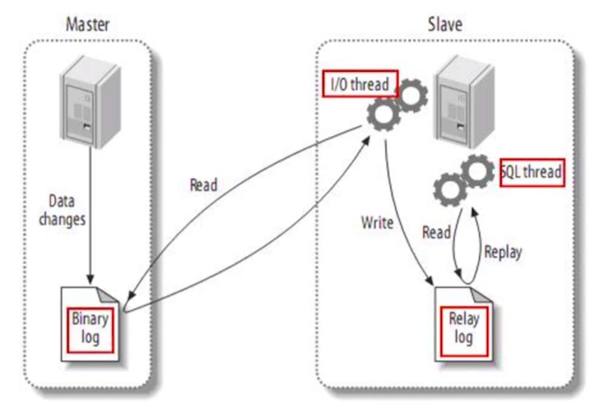

衡量标准：TPS（每秒事务量，一般几百、好的上千）

Mariadb:
cd /usr/local/opt/mariadb/bin
./mysql.server start

1: 登陆数据库
    mysql -h127.0.0.1 -uroot -p123456 --port=3306;
    mysql -h10.214.129.133 -ureaduser -pUYo9mRD7ECCeUnfm --port=3306;

2: 查询数据库信息
    status;

3: 列出database
    show databases; #select database();

4: 使用数据库
    use database_name;

5: 列出table
    show tables [FROM db_name];
    查看表结构: desc table_name;
    show columns from table_name;

    select * from book \G; #以列的形式显示结果集；

6: 慢查询日志
    记录的是整个数据库服务器的信息，而不是单个的schema信息

    查看mysql是否开启慢查询日志: show variables like 'slow_query_log';

    开启慢查询日志: set global slow_query_log=on;
    查看日志存储路径: show variables like 'slow_query_log_file';
    设置日志存储路径: set global show_query_log_file=‘/home/mysql/sql_log/mysql-slow.log’ #该目录是exit数据库后宿主机的位置

    记录【没有使用索引】的查询sql到慢查询日志: set global log_queries_not_using_indexes=on;

    记录查询超过多少秒的sql到日志中: show variables like 'long_query_time';
    设置时间: set global long_query_time=1; # 一般1秒很大，正常是100ms

    日志中记录的每一条记录信息格式如下: 
                                - # Time: 170716 13:51:27
                                - # User@Host: root[root] @ localhost []
                                - # Thread_id: 13  Schema: work-product  QC_hit: No
                                - # Query_time: 0.000208  Lock_time: 0.000044  Rows_sent: 48  Rows_examined: 48
                                - # Rows_affected: 0
                                - SET timestamp=1500184287;
                                - select * from shb_classes;

    #以上设置需要退出、进入后才能show到更新后的值；   

    慢查询工具: 
            - mysqldumpslow:
              不需要安装，mysql自带的；但是功能较少
                command: mysqldumpslow -t 4 /tmp/mysql-slow.log
                         mysqldumpslow -t 4 /tmp/mysql-slow.log | more # 通过more工具查看

            - pt-query-digest: 
              分析慢查询日志文件比mysqldumpslow更丰富 #http://blog.csdn.net/seteor/article/details/24017913
                输出到文件: pt-query-digest show-log > slow_log.report
                输出到数据库表: pt-query-digest show.log -review \
                h=127.0.0.1,D=test,p=root.P=3306,u=root,t=query_review \
                --create-reviewtable \
                --review-history t=hostname_show

                pt-query-digest分析慢查询日志文件比mysqldumpslow更丰富: 
                    1.显示日志的时间范围,以及总的sql数量.
                    2.表的统计信息sql响应时间和执行次数。
                    3.具体的sql
                解决: 
                    1.查询时间长,查询次数多
                    2.IO大的sql,分析Rows Examine项,扫描的行数
                    3.未命中索引的sql,分析Rows Examine与Rows send发送的行数的对比

            - pt-query-digest安装: #http://blog.csdn.net/wireless_com/article/details/51615627
              1.http://www.percona.com/downloads/percona-toolkit
              2.tar xvfz percona-toolkit-2.2.7.tar.gz
              3.cd percona-toolkit-2.2.17
              4.perl Makefile.PL
              5.sudo perl -MCPAN -e "install DBI"
              6.sudo perl -MCPAN -e "install DBD::mysql" #`ld: library not found for -lssl` -> The solution was:xcode-select --install
              7.perl Makefile.PL --mysql_config=/usr/local/opt/mariadb/bin/mysql_config
              8.make
              9.make install

7: 查看和日志有关的变量
    show variables like '%log%';

8: 执行计划
    MariaDB [dalin]> explain select * from book;
    # +------+-------------+-------+------+---------------+------+---------+------+------+-------+
    # | id   | select_type | table | type | possible_keys | key  | key_len | ref  | rows | Extra |
    # +------+-------------+-------+------+---------------+------+---------+------+------+-------+
    # |    1 | SIMPLE      | book  | ALL  | NULL          | NULL | NULL    | NULL |    4 |       |
    # +------+-------------+-------+------+---------------+------+---------+------+------+-------+

    table: 显示这一行的数据是关于哪张表的
    type: 这是重要的列,显示连接使用了何种类型。从最好到最差的连接类型为const、eq_reg、ref、range、index和ALL
    possible_keys: 显示可能应用在这张表中的索引。如果为空，没有可能的索引。
    key: 实际使用的索引。如果为NULL，则没有使用索引。
    key_len: 使用的索引的长度。在不损失精确性的情况下，长度越短越好。
    ref: 显示索引的哪一列被使用了,如果可能的话，是一个常数
    rows: MYSQL认为必须检查的用来返回请求数据的行数
    extra列需要注意的返回值: 
      Using filesort: 看到这个的时候，查询就需要优化了。MYSQL需要进行额外的步骤来发现如何对返回的行排序。它根据连接类型以及存储排序键值和匹配条件的全部行的行指针来排序全部行
      Using temporary: 看到这个的时候，查询需要优化了。这里，MYSQL要创建一个临时表来存储接口，这通常发生在对不同的列表进行ORDER BY上，而不是GROUP BY上。
    注意: 尽量不要使用临时表、文件排序。

    优化:  # 衡量标准：TPS（每秒事务量，一般几百、好的上千）
         --------------优化-表扫描/索引扫描-------------
         -I/O：最根本的优化，RowsSent-RowsExamine的差

         慢查询： pt_query_disgest工具
         -table：是否使用了表扫描
         -rows：扫描的行数
         -extra：using filesort/temporary文件/临时表 数据转储
         -type：const、eq_reg、ref、range、All（最慢）
         -count()优化：*和具体字段不一样，区别在于null的
         -Max()优化：不查表、只查index的sql-覆盖索引
         -子查询优化：转化成join的时可能会1对多,用distinct
         -groupby优化：子查询缩小范围，同时把聚合函数放子查询里；尽量！可以减少临时表等方式。
         limit优化：主要思想是避免过多行数的扫描。1.主键排序可以减少I/O操作；2.记录上次扫描到的id，从这个id开始可以固定扫描行数（缺点：逐渐一定要顺序增长和连续，如果不是可见建立辅助列）。
     
         -------------------设计优化-------------------
         范式化（第三范式化）
         反范式化（字段冗余）
         垂直拆分
         水平拆分
         字段：int优于time优于varchar优于text
         索引：散列值/离散度高（count唯一值大的）、小字段、不要字段冗余；离散度高的放在联合索引前面。过多的index不仅影响写，还增加查时的分析时间--删除重复和多余的index。
         冗余索引：用固定的SQL分析查找。或者pt-duplicate-key-checker工具，可给出修改建议。
         不用的索引：慢查询+pt-index-usage工具，主从结构时要分析所有DB。

    主从同步:  
         

9: Max(name): 使用name索引，全覆盖索引，执行时间永远恒定
    子查询 Vs 链接查询: 有时需要用链接查询替换子查询，以规避临时表、文件排序；有时需要用子查询 + Group by替换链接查询，以规避临时表。
    limit: 常伴随order by操作，会增加大量的 I/O 操作。优化: 1.limit之前用主键或者索引列order by一下。  2.记录上次所描的列数，作为下次的where条件，以减少每次扫描的行数。

10: 索引
    索引／查询优化器的原理: http://www.ituring.com.cn/article/986
    索引查询快的原因：
        - 索引本身占用的磁盘空间比原来的表更少，导致扫描磁盘的块数少
        - 索引是有序的数据结构，查询算法（二分法）可以提高查询速度
    一般在where、group by、order by、on从句中出现的列上加索引。
    索引字段越小越好。
    离散度高的字段放在联合索引的前面。#离散度：唯一值的个数（count唯一值大的）。
    # 查询优化器会在离散度小于记录数的30%时放弃索引，实际上等于索引纯粹只会浪费空间。
    同一个字段「尽量」不要重复、冗余建立索引。

    分析sql：（information_schema下执行）
    select
      a.TABLE_SCHEMA AS '数据名',
      a.TABLE_NAME AS '表名',
      a.INDEX_NAME AS '索引1',
      b.INDEX_NAME AS '索引2',
      a.COLUMN_NAME as '重复列名'
    from STATISTICS a JOIN STATISTICS b ON
      a.TABLE_SCHEMA = b.TABLE_SCHEMA
      AND a.TABLE_NAME = b.TABLE_NAME
      AND a.SEQ_IN_INDEX = b.SEQ_IN_INDEX
      AND a.COLUMN_NAME = b.COLUMN_NAME

    查看建表语句: show create table databases.table_name; 
    分析工具: pt-duplicate-key-checker 
    未使用索引: MariaDB：INDEX_STATISTICS表可以分析，Mysql只能通过工具
    冗余索引: 用固定的SQL分析查找。或者pt-duplicate-key-checker工具，可给出修改建议。
    不用的索引: 慢查询+pt-index-usage工具，主从结构时要分析所有DB。

11: 关键字
    Any、Some、All

12: 多表更新/主键
    update table1 INNER_JOIN table2 on t1.cln = t2.cln set t1.cln_1 = t2.cln_2; #参考table2更新table1

    ALTER TABLE author DROP PRIMARY KEY;
    ALTER TABLE author modify id int(11) NOT NULL AUTO_INCREMENT PRIMARY KEY;

13: Mysql 5.7复制功能（mysql复制集群）
    Mysql复制: 异步（默认方式，半同步也是异步也有延迟）（受主的写的频率影响：主的写是并发的，而log操作同步到salve是单线程的）
    
    Mysql的复制是基于BinLog的:
      三种日志格式: 
        Statement: 存储SQL语句，文件小，某些函数可能会造成主从不一致，不建议使用
        Row: 存储event数据，存储日志量大，但是不能很直接的进行读取
        Mixed: 介于Row和Statement之间，对于不确定的操作使用Row记录，如果每天数据操作量很大，产生的日志比较多，可以考虑选择mixed格式。
    
    部分复制: mysql的复制可以是整个数据库实例或者是某个库，某个表.
            主要通过master的binlog-do-db哪些要记录日志  -ignore-db哪些不用记录日志，slave可以通过replicate -do-db. 
            -ignore-db...等复制命令进行同步进行控制.建议一般是通过slave端进行控制，可以更精细化的控制,master建立完整的日志操作。

    复制类型: 
        二进制日志的复制、
        5.5之前是基于二进制的日志类型复制，但主从切换时无法确定具体的切换点。使用gtid基于全局事务的复制，每一个事务对应一个全局标识，可
        以很容易的找到复制点。为高可用带来很大方便。mysql5.7开始支持半同步优化主从复制，通过安装一些插件，日志先入的方式，等待某一个或者
        某几个slave返回确认ok后进行真正的事务提交。

14: 秒杀: #http://www.cnblogs.com/clphp/p/6398667.html
  Step1:
    1.接下来，每次插入前执行以下以下操作检查一下是否超卖即可：
      select sum(buy_count) from UserProduct where product_id = ?
    2.最后还要检查一下这个用户是否购买过：
      select count(*) from UserProduct where user_id = ? and product_id = ?
    3.全都没问题了就插入数据：
      insert into UserProduct (user_id, product_id, buy_count) values (?, ?, ?)

  Step2-优化:
    3的问题-保证单用户不会重复购买：加上唯一索引(user_id, product_id)

  Step3-优化: （一般秒杀场景够用）
    1、2的问题-解决超卖问题：1的SQL加上for update，三个语句放在同一个事物中 
    # 为了for update是行锁而不是表锁，需要在product_id上加一个索引

  Step4-优化: （超大规模秒杀场景够用）
    Step3的优化会影响性能。
    对策：去掉事物，同时把1的语句换成如下：
    update Product set buy_count = buy_count+? where id = ? and buy_count+? <= buy_max
    
  最终方案:
    1.update Product set buy_count = buy_count+? where id = ? and buy_count+? <= buy_max
    2.insert into UserProduct (user_id, product_id, buy_count) values (?, ?, ?) #有唯一索引
    同时，如果第二步失败了（重复购买），需要逆向执行一句1的SQL，把库存还回去。

