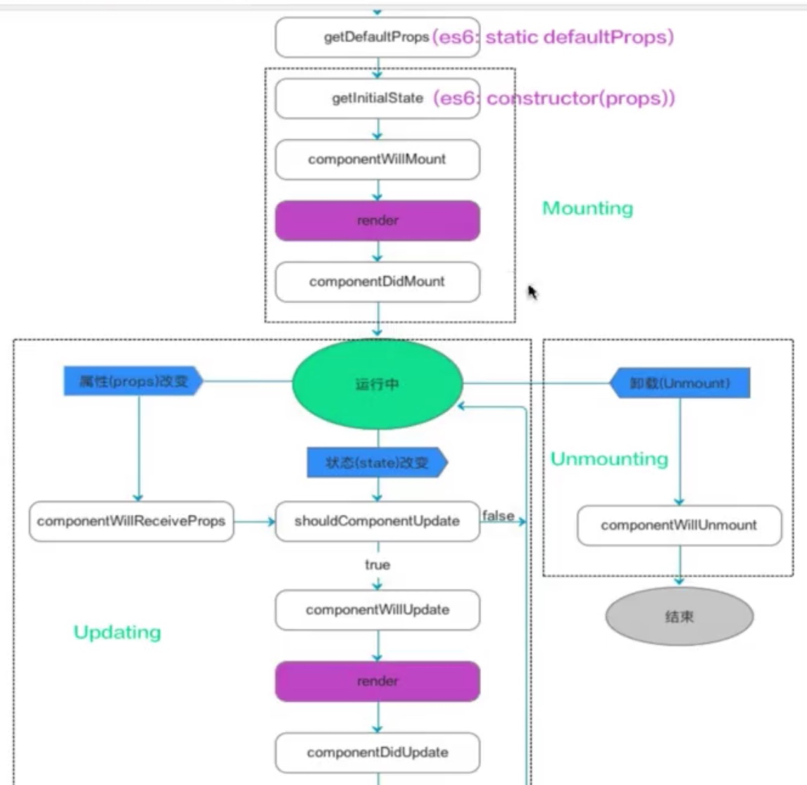

1: React
 Native

    1.1: 类 - ES6 引入了class（类）
      # 参考：http://www.devio.org/2016/08/11/React-Native之React速学教程-(下)/
      - 区别于组件的定义：没有继承Componment
      - 对父类的构造方法的调用时必须的
      - 命名空间
      
    1.2: 模块module
      # 参考：http://www.devio.org/2016/08/11/React-Native之React速学教程-(下)/
      ES5不支持原生的模块化，在ES6中，模块将作为重要的组成部分被添加进来。
      模块的功能主要由 export 和 import 组成。每一个模块都有自己单独的作用域，模块之间的相互调用关系是通过 export 来规定模
      块对外暴露的接口，通过import来引用其它模块提供的接口。同时还为模块创造了命名空间，防止函数的命名冲突。
      与Java的区别：成员变量不需要显示声明

      - 导出(export)
        变量、常量、方法、类、函数
        ES6的方式: 
          export default class MyComponent extends Component{
          }
        ES5的方式: 
          var MyComponent = React.createClass({...});
          module.exports = MyComponent;

      - 导入(import)（尽量使用ES6的方式）
        # 导入自己写的js一定不要忘了写‘./’,否则会以为引入的是modules。import Login from './login'
        ES6的方式: import+from
          import { StyleSheet } from 'react-native';
          import size from './size';// size.js
          语法: import defaultMethod, { otherMethod } from 'xxx.js';
        ES5的方式: require
          var React = require("react");
          var {Component,PropTypes} = React;
          var AboutPage=require('./app/AboutPage')
        注：import自定义组件的变量名（defaultMethod）必须大写否则：Invariant Violation：View config not found for name XX

    1.3: 箭头（=>）
      类似Lambda表达式，不论是箭头函数还是bind，每次被执行都返回的是一个新的函数引用，因此如果要用该引用去做一些别的事情
      （譬如卸载监听器），那么你必须自己保存这个引用，这有点类似Scala中的call by name（如：def foo(x:=> Int) = x），
      而Scala默认是使用Call by value，如：def foo(x:Int) = x。
      错误的做法: 
        # class PauseMenu extends React.Component{
        #     componentWillMount(){
        #         AppStateIOS.addEventListener('change', this.onAppPaused.bind(this));
        #     }
        #     onAppPaused(event){
        #     }
        # }
      正确的做法: 
        # class PauseMenu extends React.Component{
        #     constructor(props){
        #         super(props);
        #         this._onAppPaused = this.onAppPaused.bind(this);
        #     }
        #     componentWillUnmount(){
        #         AppStateIOS.removeEventListener('change', this._onAppPaused);
        #     }
        #     onAppPaused(event){
        #     }
        # }

    1.4: ES6 VS ES5（ES6与ES5的区别）
      # 参考：http://www.devio.org/2016/08/11/React-Native之React速学教程-(下)/
      - ES6: 2015年ECMAScript 6.0标准
      - ES6新特性：
        1.1、1.2、1.3、static关键字
      - 区别: 
        * ES6不再支持Mixins(可以使用增强组件来替代Mixins)
        * ES6不再有自动绑定(箭头函数或者bind实现)
        * 定义方法、属性、组件等的方式都不同
        * 初始化state方式不同
        * 回调函数的方式不同

2: React Native
环境配置
    2.1: 环境
    
      NodeJs
      React Native Command Line Tools
      Xcode／Android studio

    2.2: 安装
      - 更新brew
        > brew upgrade
        > brew update
        注：如果失败：http://www.jianshu.com/p/61634c8ed302 (更换Homebrew更新源)

      - 安装node
        > brew install node
        > node -v //node --version 来检查node安装版本

      - 安装ReactNative命令行工具
        > npm install -g react-native-cli
        > react-native --help //检查安装是否成功以及react-native支持那些命令

    2.3: 初始化第一个工程
      > react-native init FirstApp
        * added 198 packages and updated 2 packages in 18.024s
        * To run your app on iOS:
        *    cd /Users/lilinlin/React Native/FirstApp
        *    >react-native run-ios
        *    - or -
        *    Open ios/FirestApp.xcodeproj in Xcode
        *    Hit the Run button
        * To run your app on Android:
        *    cd /Users/lilinlin/React Native/FirstApp
        *    Have an Android emulator running (quickest way to get started), or a device connected
        *    >react-native run-android
        注：打开IOS平台的话需要Xcode可能正常打开（Xcode必要的初始化工作已完成）否则会报错

        iOS: 
          - Xcode打开ios目录下的FirstApp.xcodeproj（会自动启动apple模拟器），再点击run
          - react-native run-ios，会自动启动apple模拟器
        android: 
          - 先启动一个android模拟器（emulator -avd A23 或者 通过Android Studio里的AVD Manager启动）
            （A23是模拟器的名字，可以用emulator -list-avds这个命令查询有哪些模拟器）
            再通过react-native run-android（第一次可能时间比较久）
          - 直接在Android Studio里点击Run app
          注: 安装Android Studio之后需要配置做以下配置，同时emulator不能选择版本太高的，否则会报无法连接的错误。
              export ANDROID_HOME=~/Library/Android/sdk
              export PATH=$PATH:$ANDROID_HOME/tools //如果emulator命令无效换成：export PATH=$PATH:$ANDROID_HOME/emulator

    2.4: 下载一个工程
      对于一个clone的工程，就像maven工程一样，首先需要把一个工程需要的依赖下下来进行装包（依赖描述文件：package.json）需要执行以下命令：
      > npm install

3: 运行React-native官方例子
    3.1: NDK
      - 官方的例子要使用JNI，所以必须安装NDK（gcc4.0）
      - 必须设置环境变量【ANDROID_NDK】，而且NDK必须是【r10e】版本（重要）
        # export ANDROID_NDK=/Users/lilinlin/Library/Android/sdk/android-ndk-r10e
        # export PATH=$PATH:$ANDROID_NDK
      - NDK装好后要在【ANDROID_NDK】目录下的/samples/hello-jni/jni下执行ndk-build
      - 工程不能和ndk都放在/Users/lilinlin目录下，目前工程是放在Desktop的，否则IOS和android都会失败
    3.4: 运行
      Running this app:
        cd react-native
        npm install
        Open RNTester/RNTester.xcodeproj in Xcode
        Hit the Run button
      Running on Android:
        cd react-native
        ./gradlew :RNTester:android:app:installDebug
        ./scripts/packager.sh

4: 使用React-native官方的例子
    4.1: 修改配置
      - build.gradle文件下dependencies的com.android.support版本修改为【v7:23.0.1】（和官网的保持一致）
      - build.gradle文件下android的compileSdkVersion，buildToolsVersion，targetSdkVersion修改为【23】【23.0.1】【23】
      - project目录下的android下的app/src/..../MainApplication.java中的getJSMainModuleName()是安卓执执行的入口，
        需要修改成RNTestApp.android.js的路径
      - RNTestApp.android.js里需要添加一行AppRegistry.registerComponent('FirstApp', () => RNTesterApp);
        否则会报没有注册的错。
      注: 第四步的修改其实是因为必须要和第三步同目录下的MainActivity.java里的getMainComponentName方法的返回值保持一致。

5: 组件
    5.1: 生命周期
      三个状态:
        mounting：已插入真是Dom，All方法一次性调用
        updating：已更新Dom，All方法重复调用
        unmounting：已删除真实Dom，All方法一次性调用
        # 方法的命名规则:will、did分别为初始化前、事件后执行（时序图参考icloud备忘录）
        

    5.2: 自定义组件
      - 定义、导入、导出分别有ES5、ES6、函数式三种；导入的时候需要注意，定义的对象必须是大写开头。
      - 三种自定义组件的方式:
        * ES6
          # export default class selfcompent extends Component{
          #     render(){
          #          return <Text stytle={{size:20px,background:’red’}}> Hello {this.props.name}</Text>
          #     }
          # }

        * ES5
          # var selfcompent=React.creatClass({
          #     render(){
          #          return <Text stytle={{size:20px,background:’red’}}> Hello {props.name}</Text>
          #     }
          # })
          # module.exports=selfcompent;

        * 函数式
          # function selfcompent(props){
          # return <Text stytle={{size:20px,background:’red’}}> Hello {props.name}</Text>
          # }
          # module.exports=selfcompent;

    5.3: 自定义组件 - props（属性）
      - 属于组件的成员变量，调用时使用this.props.xxx
      - 组件变量的默认数据、数据格式、必填项校验:
        static defaultProps={
          name:"Jack"
          age:"12"
        }
        static propTypes={
          name:PropTypes.string,
          age:PropTypes.number.isRequired,
        }

      - 赋值 - 延展操作符 & 结构赋值（只取部分变量赋值）
        延展操作符: 全部Json数据中的变量传递给下层组件
        结构赋值: 只有部分Json数据中的变量传递给下层组件

        var params={name:"Jack",age:"12",sex="Man"}
        普通做法:
          <SelfComponment 
            name={params.name}
            age={params.age}
            sex={params.sex}
          />
        延展操作符: 
          <SelfComponment {...params}/>
        结构赋值法:
          var {name,sex}=params;
          <SelfComponment 
            name={name}
            sex={sex}
          />

    5.4: 自定义组件 - state（状态）
      - 属于组件的成员变量，调用时使用this.state.xxx；初始化方式可以在constructor也可以想java一样在成员变量区域初始化。
      - 与props的区别:
        props：属于调用方，调用时指定，指定后一般不变

        state：私属于组件本身，可被调用方改变

    5.5: 自定义组件 - ref（引用）
      - 虚拟DOM-实际DOM
      - ref定义、获取
  

6: 布局
  - FlexBox
    - flex:1: 占满全部父容器空间，具有短路height／width的功能

    - justifyContent: 主轴方向对齐方式，表示在水平方向或垂直方向子元素的对齐方式，需要配合flexDirection使用。
      当父容器flexDirection:'row'时
        justifyContent:'flex-start'，表示子元素水平方向左对齐
        justifyContent:'center'，表示子元素水平居中对齐
        justifyContent:'flex-end'，表示子元素水平方向右对齐
        justifyContent:'space-between'，表示子元素水平方向元素之间间隔相同
        justifyContent:'space-around'，表示子元素水平方向元素两边间隔相同
      当父容器flexDirection:'column'时
        justifyContent:'flex-start' ，表示子元素垂直方向上对齐
        justifyContent:'center'，表示子元素垂直居下对齐
        justifyContent:'flex-end'，表示子元素垂直方向居中对齐
        justifyContent:'space-between'，表示垂直方向子元素之间间隔相同
        justifyContent:'space-around'，表示垂直方向子元素两边间隔相同

    - alignItems: 交叉轴方向对齐方式，表示在水平方向或垂直方向子元素的对齐方式，需要配合flexDirection使用。与之相似的还有alignSelf，
      alignSelf表示自己相对于父容器的对齐方式，用法与alignItems相同。这里要注意，alignItems与justifyContent在flexDirection上的对齐方向相反。
      当父容器flexDirection:'column'时
        alignItems:'flex-start' ，表示子元素水平方向左对齐
        alignItems:'center'，表示子元素水平居中对齐
        alignItems:'flex-end'，表示子元素水平方向右对齐
      当父容器flexDirection:'row'时
        alignItems:'flex-start'，表示子元素垂直方向上对齐
        alignItems:'center'，表示子元素垂直居下对齐
        alignItems:'flex-end'，表示子元素垂直方向居中对齐

    - justifyContent/alignItems: 标示水平垂直居中

    - flexWrap: 子元素超出容器时是否换行显示
        flexWrap:'wrap'，表示超出则换行显示，默认超出换行显示
        flexWrap:'nowrap'，表示超出不换行显示

  - 没有单位(自动解析成IOS、Android的单位)
  - 与Web CSSS中的FlexBox的区别
  - 主轴、侧轴，默认排列方式
  - flexDirection：行、列开始方式
  - flexWrap：溢出是否重新开始一行
  - justifyContent:主轴（X）间距控制
  - alignItems:侧轴（Y）间距、拉伸控制，包括是否拉伸适应（如果没有制定长宽，默认全部填充）
  - 子视图:
    * alignSelf:子视图间距控制
    * flex:拉伸（默认是0，指：权重）
  - border:边框
  - 边框颜色等。。。。。
  - 外边距。。。。。。
  - 左右内边距。。。。。
  

7: 编译 & 更新npm工程
  npm install react-native-vector-icons --save
  react-native link
  rnpm link

8: Bug
  'FontAwesome' not found 
  #https://github.com/oblador/react-native-vector-icons/issues/630

9: 开启debug工具
  react-devtools
  open the in-app developer menu and choose "Show Inspector"

10: Redux
  Store: - 容器
         - store.dispatch()是 View 发出 Action 的唯一方法。
  State: Store对象包含所有数据。如果想得到某个时点的数据，就要对 Store 生成快照。这种时点的数据集合，就叫做 State。
         Redux 规定， 一个 State 对应一个 View。只要 State 相同，View 就相同。你知道 State，就知道 View 是什么样，反之亦然。
  Action: State 的变化，会导致 View 的变化。但是，用户接触不到 State，只能接触到 View。所以，State 的变化必须是 View 导致的。
          Action 就是 View 发出的通知，表示 State 应该要发生变化了。
  Reducer: Store 收到 Action 以后，必须给出一个新的 State，这样 View 才会发生变化。这种 State 的计算过程就叫做 Reducer。
           Reducer 是一个函数，它接受 Action 和当前 State 作为参数，返回一个新的 State。
  mapStateToProps(): 建立一个从（外部的）state对象到（UI 组件的）props对象的映射关系。会订阅 Store，每当state更新的时候，就
                     会自动执行，重新计算 UI 组件的参数，从而触发 UI 组件的重新渲染。
  mapDispatchToProps(): 用来建立 UI 组件的参数到store.dispatch方法的映射。也就是说，它定义了哪些用户的操作应该当作 Action，
                     传给 Store。它可以是一个函数，也可以是一个对象。
  
  用mvc的方式解释:
        Store: Tomcat
          store.dispatch(): DispacthServlet
        State: View
        Action: Controller
        Reducer: RequestMapping + HandlerAdpter的一个过程
        mapStateToProps(): view -> html
        mapDispatchToProps(): RequestMapping

00: app启动画面
  https://github.com/crazycodeboy/react-native-splash-screen/
  但是ios需要在Images.scassets新建LaunchImage，同时要把App Icons and launch Images下的Launch Screen Files设置为空
  PS: xcode清理缓存: Xcode／perference／Locations／Derived Data，在文件夹中打开，然后删除缓存文件（该文件夹下的所有的）

01: app的icon和名字
  icon:
    android: 替换android/app/src/res/****-****/文件夹下的图片即可
    iod: 项目的Images.xcassets下的AppIcon

  名字:
    android: 修改android/app/src/res/values/strings.xml即可
    iod: 项目的Info.plist的Bundle display name

000: 心得
  类似app启动换面的方案：使用react-native-splash-screen/开源组件，是需要npm install即可不需要的话可以npm uninstall

<ImageBackground
                    style={[styles.flexDirectionColumn, styles.headerWrap]}
                    source={imageSource.myHeaderBg}
                    imageStyle={[
                        {resizeMode: 'cover'},
                        styles.headerWrap
                    ]}>

                </ImageBackground>

